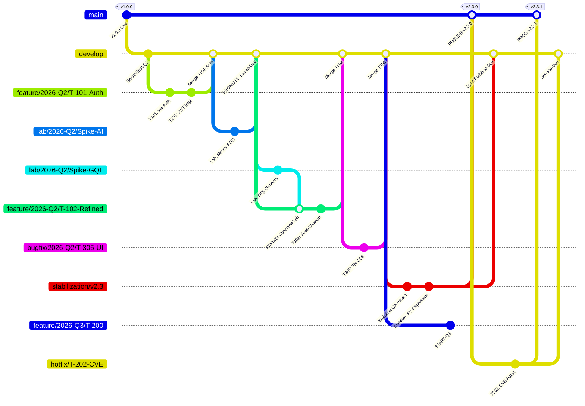

# Sync Resolution: TECH-004 and ADR-006

**Date:** 2026-04-09  
**Source:** Human + AI (via Gemini)  
**Mode:** Architect  
**Participants:** Human, Architect Agent

---

## Context

TECH-004 (Master Traceability Tree — Enhanced Git Flow) was proposed as an enhancement to Git Flow branching strategy. It overlapped with ADR-006 (GitFlow Enforcement — Branch Lifecycle) which was already implemented in `.clinerules` RULE 10.

### Overlap Analysis

| Aspect | TECH-004 | ADR-006 | Resolution |
|--------|----------|---------|------------|
| Branch types | feature, lab, bugfix, hotfix, release | feature, lab, bugfix, hotfix, release | Unified — TECH-004 aligns to ADR-006 |
| develop-vX.Y | Not in original proposal | Introduced as scoped backlog branch | **Changed to `stabilization/vX.Y`** |
| Release stabilization | `release/vX.Y.Z` | Not specified | **Excised — use `stabilization/vX.Y` instead** |
| Refining workflow | Strategy B: lab → feature → develop | Not documented | **Added to systemPatterns.md** |

### Sync Decision

**Category:** 🟠 SHARED_LAYER — Both touch the same component (RULE 10 branch lifecycle)

**Resolution:** TECH-004 is an **extension of ADR-006**, not a replacement.

- TECH-004 status → `[ACCEPTED-EXTENSION]`
- `develop-vX.Y` renamed to `stabilization/vX.Y` (human approved)
- `release/vX.Y.Z` concept excised — stabilization is permanent artifact, not timeboxed
- Refining Workflow (Strategy B) documented in `memory-bank/hot-context/systemPatterns.md`

---

## Changes Applied

### 1. TECH-SUGGESTIONS-BACKLOG.md

- TECH-004 status changed to `[ACCEPTED-EXTENSION]`
- Note added: "Extension of ADR-006. stabilization/vX.Y replaces release/vX.Y.Z. Refining workflow documented."

### 2. memory-bank/hot-context/systemPatterns.md

- Added "Refining Workflow (Strategy B)" section
- Included canonical Mermaid diagram verbatim
- Documented Z-pattern (lab → feature → develop)
- Added branch naming conventions table
- Documented `stabilization/vX.Y` as permanent artifact vs timeboxed branches

### 3. Conversation Log Created

- File: `docs/conversations/SYNC-TECH-004-ADR-006-2026-04-09.md`
- README.md updated with entry

---

## Canonical Mermaid Diagram

---

## Pending Delegations

| Task | Owner | Status |
|------|-------|--------|
| Update decisionLog.md (ADR-006 amendment) | Scrum Master | Pending |
| Update .clinerules RULE 10 | Scrum Master | Pending |
| Update activeContext.md | Architect | Pending |
| Update RELEASE.md | Architect | Pending |

---

## Triage Status

**Not yet triaged** — This was a sync/coordination session, not an ideation session. No new ideas generated.
