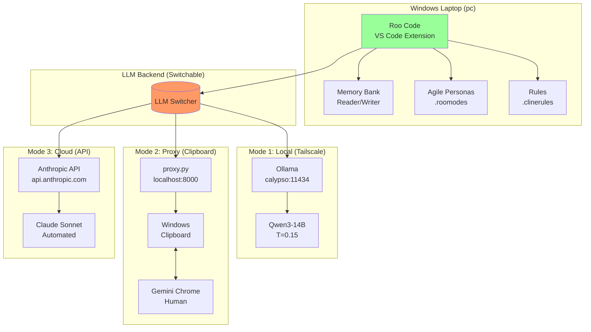
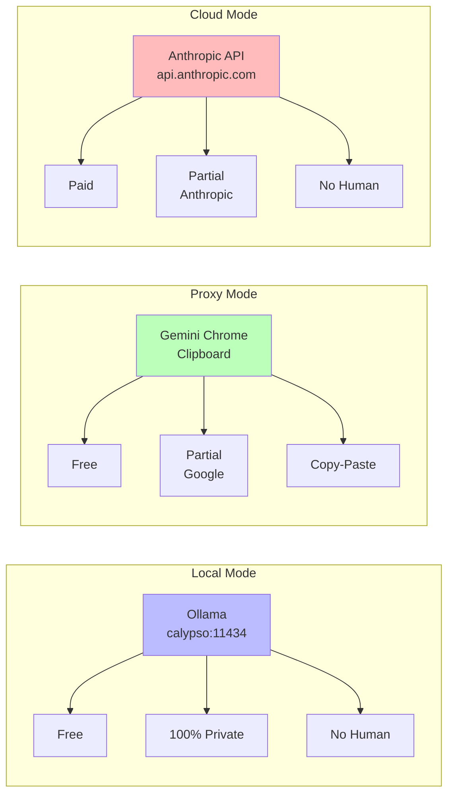
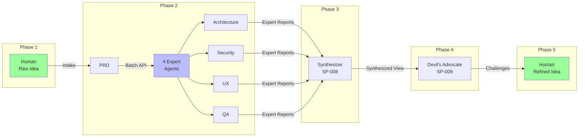
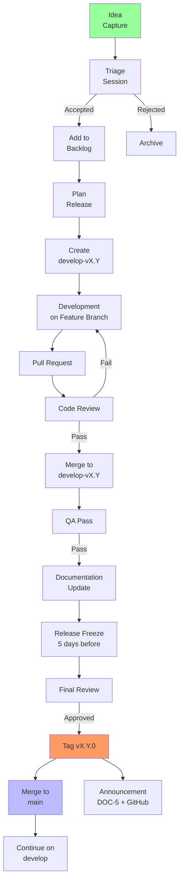

## Description

Enrich canonical docs (DOC-1 through DOC-5) with Mermaid diagrams, sequence charts, flowcharts, and other visual elements to illustrate:

- Processes (ideation-to-release pipeline)
- Architectures (Hot/Cold memory, Calypso 4-agent)
- Partitioning (workbench vs application projects)
- Environments (Windows PC vs Calypso vs cloud)
- GitFlow (branch lifecycle, release workflow)
- System boundaries and data flow

## Motivation

Canonical docs are currently text-heavy with minimal visual documentation. Visual diagrams would:
1. Improve comprehension of complex workflows
2. Clarify scope boundaries (workbench-only vs application-project)
3. Make onboarding easier for new contributors
4. Document environment-specific behaviors (Windows vs Calypso vs cloud)
5. Illustrate GitFlow at a glance

## Classification

Type: BUSINESS (documentation improvement)

## Implementation Status

| Document | Status | Diagrams Added |
|----------|--------|---------------|
| DOC-2 (Architecture) | **DONE** ✓ | 6 diagrams in Section 15 |
| DOC-1 (PRD) | **PENDING** | 5 diagrams proposed below |
| DOC-3 (Implementation) | **PENDING** | 3 diagrams proposed below |
| DOC-4 (Operations) | **PENDING** | TBD (future scope) |
| DOC-5 (Release Notes) | **N/A** | No diagrams (changelog format) |

## Scope

### DOC-1 (PRD) — 5 Diagrams Needed:

| # | Section | Current Format | Proposed Diagram | Type |
|---|---------|---------------|------------------|------|
| 1.1 | §1.4 System Architecture Summary | Table | System Overview | `graph TB` |
| 1.2 | §1.5 Three LLM Backend Modes | Table | Mode Comparison | `graph LR` with comparison boxes |
| 1.3 | §1.6 Memory Bank Architecture | ASCII art | Hot/Cold Architecture | `graph LR` (mirror DOC-2 §15.3) |
| 1.4 | §13.1 Phase Overview | Table | Calypso Orchestration Phases | `flowchart LR` |
| 1.5 | §14.2 Sync Detection Flow | Text | Sync Detection Pipeline | `flowchart TD` |

**Rationale:** These sections are heavy on tables/text and would benefit from visual representation. Mirror DOC-2 where applicable to maintain consistency.

### DOC-2 (Architecture) — COMPLETE ✓

Section 15 already contains 6 Mermaid diagrams:
- §15.1 System Overview Diagram (`graph TB`)
- §15.2 Calypso Orchestration Flow (`sequenceDiagram`)
- §15.3 Memory Bank Hot/Cold Architecture (`graph LR`)
- §15.4 Proxy Mode Data Flow (`sequenceDiagram`)
- §15.5 GitFlow Branch Lifecycle (`gitGraph`)
- §15.6 Additional flowchart (`flowchart TD`)

### DOC-3 (Implementation Plan) — 3 Diagrams Needed:

| # | Section | Current Format | Proposed Diagram | Type |
|---|---------|---------------|------------------|------|
| 3.1 | §2 (Release Scope) | Text | Ideation-to-Release Pipeline | `flowchart TD` |
| 3.2 | §2.2 Branch Strategy | ASCII art | GitFlow Branch Lifecycle | `gitGraph` or `graph TB` |
| 3.3 | §3.3 Definition of Done | Checklist | Definition of Done Flow | `flowchart LR` |

**Rationale:** DOC-3 is release-specific starting v2.10. Visualizing the workflow helps reviewers understand the release process.

## Complexity Score

**Score: 2/10** — LOW EFFORT (pure documentation, no code changes)

## Affected Documents

- `docs/releases/v2.9/DOC-1-v2.9-PRD.md` (cumulative)
- `docs/releases/v2.10/DOC-1-v2.10-PRD.md` (current draft)
- `docs/releases/v2.9/DOC-2-v2.9-Architecture.md` (**already complete**)
- `docs/releases/v2.10/DOC-3-v2.10-Implementation-Plan.md` (release-specific)
- `docs/releases/v2.9/DOC-4-v2.9-Operations-Guide.md` (future scope)

## Proposed Mermaid Diagrams (Detailed)

### DOC-1 §1.4 — System Overview Diagram

### DOC-1 §1.5 — Three LLM Backend Modes Comparison

### DOC-1 §13.1 — Calypso Orchestration Phases

### DOC-3 §2 — Ideation-to-Release Pipeline

## Implementation Notes

1. **Diagram Style Consistency:** Use the same styling as DOC-2 §15 (color fills, node shapes)
2. **Source Attribution:** Add `**Source:**` line before each diagram citing the section it illustrates
3. **Incremental Approach:** Add diagrams one at a time, commit after each
4. **Review Before Commit:** Verify Mermaid renders correctly in VS Code preview

## Next Steps

1. [ ] Implement DOC-1 §1.4 System Overview diagram
2. [ ] Implement DOC-1 §1.5 Mode Comparison diagram
3. [ ] Implement DOC-1 §1.6 Hot/Cold Memory diagram (mirror DOC-2)
4. [ ] Implement DOC-1 §13.1 Orchestration Phases diagram
5. [ ] Implement DOC-1 §14.2 Sync Detection Flow diagram
6. [ ] Implement DOC-3 §2 Ideation-to-Release Pipeline diagram
7. [ ] Implement DOC-3 §2.2 GitFlow Branch Lifecycle diagram
8. [ ] Implement DOC-3 §3.3 Definition of Done Flow diagram
9. [ ] Update IDEAS-BACKLOG.md status to [IMPLEMENTED] when all complete

---

## Status History

| Date | Status | Notes |
|------|--------|-------|
| 2026-04-01 | [IDEA] | Captured from human suggestion |
| 2026-04-08 | [PARTIAL] | DOC-2 complete; DOC-1 and DOC-3 need diagrams - refined by Architect |

---
