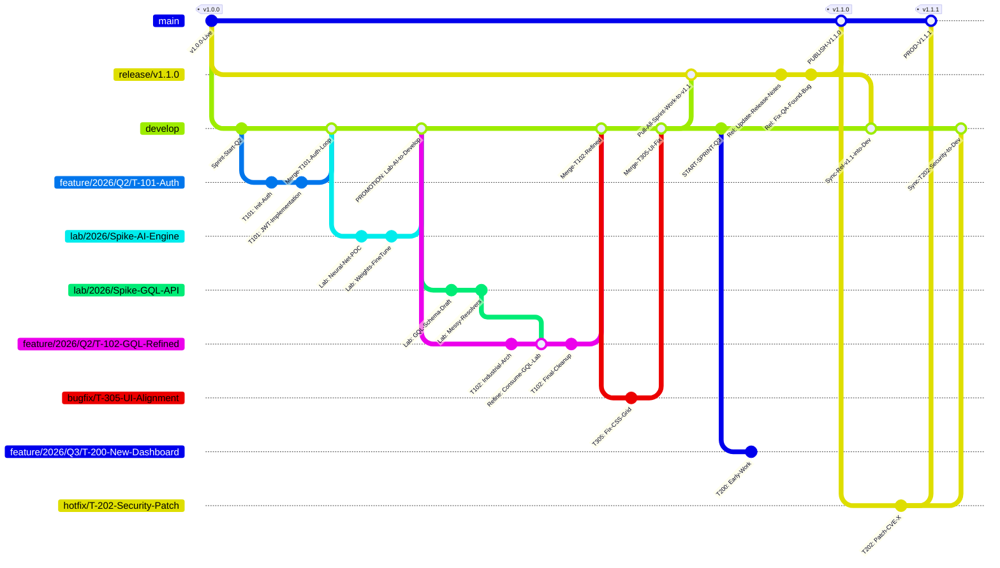

# TECH-004: Master Traceability Tree — Enhanced Git Flow with Full Traceability

**Status:** [RELEASED-v2.15] — Extension of ADR-006. Branch types (lab/, bugfix/), stabilization/vX.Y naming, Refining Workflow (lab→feature→develop) implemented via ADR-006-AMEND-001.
**Captured:** 2026-04-08
**Source:** User discussion with Gemini
**Classification:** TECHNICAL (How)
**Supersedes:** TECH-001, TECH-002, TECH-003 (unrelated)
**Potential Overlap:** ADR-006 (develop/main branching model)
**Released:** v2.15 (ADR-006-AMEND-001)

---

## Summary

An enhanced Git branching strategy that provides comprehensive traceability from initial lab experiments through production deployment, with explicit handling of ad-hoc work, formal features, release stabilization, and emergency fixes.

## Motivation

The current GitFlow (ADR-006) provides clean branch naming but lacks:
1. Explicit handling of ad-hoc/experimental work (lab branches)
2. Clear "refining" workflow for converting experiments into production features
3. Hot vs. Cold fix separation with distinct merge paths
4. Visual "diamond" patterns for emergency production fixes
5. Release buffer parallelism (develop continues while release is stabilized)

## Detailed Proposal

### The Master Traceability Tree

---

## Key Traceability Concepts

### 1. The "Refining" Logic (Strategy B)

In the diagram, look at `feature/...-GQL-Refined`:
- It explicitly merges the `lab/` branch **first** to consume the logic
- It then merges into `develop`
- **Result:** When you look at the visual graph, you see a "Z" shaped flow where the experiment flows into the feature, and the feature flows into the product. You never lose the "messy" research code, but the product history remains clean.

### 2. The Release Buffer Parallelism

Note that between the `Pull-All-Sprint-Work` and `PUBLISH-V1.1.0` commits, the **Develop** branch has already branched off into `feature/2026/Q3/T-200`.

- **Benefit:** Your "Real Time" representation shows two independent paths of travel. One path is calm and focused on fixing release bugs; the other is the high-energy start of the next quarter.

### 3. Hot vs. Cold Fix Separation

| Fix Type | Branch Pattern | Merge Path | Visual Pattern |
|----------|---------------|------------|----------------|
| **Cold** (`bugfix/T-305`) | Pre-release bug | `develop` → `release` → `main` | Linear pipeline |
| **Hot** (`hotfix/T-202`) | Emergency from prod tag | Branches from `main` tag, merges to both `main` AND `develop` | Diamond shape |

---

## Traceability Naming Convention Summary

| Category | Branch Path Pattern | Permanent Trace Method |
|:---------|:-------------------|:----------------------|
| **Planned Dev** | `feature/YYYY/QN/T-xxx-name` | `--no-ff` Merge Loop |
| **Ad-Hoc (Direct)** | `lab/YYYY/Spike-name` | Direct `--no-ff` Merge into Develop |
| **Ad-Hoc (Refined)** | `lab/` → `feature/` | Lab merged into Feature, Feature merged into Dev |
| **Release** | `release/vX.X.X` | Staged merge (Dev → Release → Main) |
| **Cold Fix** | `bugfix/T-xxx-name` | `--no-ff` Merge into Develop |
| **Hot Fix** | `hotfix/T-xxx-name` | Dual Merge (Main & Develop) + Tagging |

---

## Relationship to ADR-006

ADR-006 defines the high-level branch model:
- `main` (frozen production)
- `develop` (wild mainline)
- `develop-vX.Y` (scoped backlog)
- `feature/{IDEA-NNN}-{slug}`
- `hotfix/vX.Y.Z`

**TECH-004 extends ADR-006** by adding:
1. `lab/` branch type for ad-hoc exploration
2. `bugfix/` branch type for pre-release cold fixes
3. `release/vX.Y.Z` branch for release stabilization buffer
4. Explicit "refining" workflow (lab → feature)
5. Release parallelism (develop continues while release stabilizes)

---

## Integration Points

- **RULE 10 (GitFlow):** May need extension to include `lab/`, `bugfix/`, and `release/` branch lifecycle
- **ADR-006:** TECH-004 is additive to ADR-006, not a replacement
- **memory-bank/systemPatterns.md:** New pattern for lab-to-feature workflow

---

## Next Steps

- [x] Architect review: Evaluate feasibility and complexity
- [x] Sync with ADR-006 author to ensure compatibility
- [x] Decision: ACCEPTED / REJECTED / NEEDS_MORE_INFO
- [x] Implemented: Update RULE 10 and systemPatterns.md via ADR-006-AMEND-001

## Release History

| Version | Date | Components |
|---------|------|------------|
| v2.14 | 2026-04-08 | Branch types (lab/, bugfix/) and --no-ff merge strategy accepted |
| v2.15 | 2026-04-09 | ADR-006-AMEND-001: stabilization/vX.Y rename, main rename, Refining Workflow (lab→feature→develop) |
