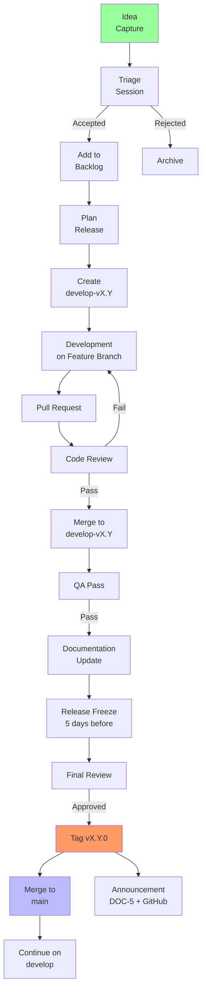
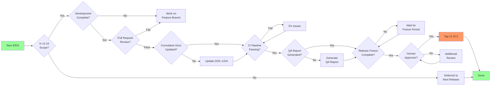

# DOC-3 — Implementation Plan (v2.10)

> **Status: DRAFT** -- This document is under construction for v2.10 release.
> **Release-Specific: YES** -- This document contains ONLY v2.10 implementation scope.
> **Cumulative: NO** -- This is NOT a cumulative document. Historical implementation details are preserved in `docs/releases/vX.Y/DOC-3-vX.Y-Implementation-Plan.md`.

---

## Table of Contents

1. [v2.10 Release Scope](#1-v210-release-scope)
2. [Key Implementation Decisions](#2-key-implementation-decisions)
3. [Execution Tracking](#3-execution-tracking)
4. [Dependencies and Risks](#4-dependencies-and-risks)

---

## 1. v2.10 Release Scope

*(To be populated when IDEAS are formally triaged for v2.10)*

### IDEAS in Scope

| IDEA | Title | Status |
|------|-------|--------|
| (TBD) | (TBD) | (TBD) |

### Features

*(To be defined during v2.10 planning)*

---

**Source:** [IDEA-016 §2]



---

## 2. Key Implementation Decisions

*(This section documents significant architectural or implementation decisions made in v2.10, with brief cross-references to prior releases where relevant.)*

### 2.1 Decision: Release-Specific DOC-3 and DOC-5

**Context:** IDEA-021 introduced the concept of release-specific DOC-3 and DOC-5 starting from v2.10.

**Decision:** DOC-3 and DOC-5 are now release-specific documents, not cumulative. Historical versions are preserved in their respective `docs/releases/vX.Y/` directories.

**Cross-reference:** This continues the governance improvements from:
- IDEA-017 (Cumulative Docs Requirement)
- IDEA-020 (Deterministic Docs from Sources)

**Consequences:**
- DOC-3 focuses only on this release's implementation scope
- DOC-5 documents only what changed in this release
- Reduced doc bloat and clearer focus per release

### 2.2 Branch Strategy Diagram

**Source:** [IDEA-016 §2.2]

```mermaid
gitGraph
    commit id: "develop"
    commit id: "develop-v2.10"
    branch feature/IDEA-014
    commit id: "IDEA-014"
    checkout develop-v2.10
    merge feature/IDEA-014
    branch feature/IDEA-015
    commit id: "IDEA-015"
    checkout develop-v2.10
    merge feature/IDEA-015
    branch feature/IDEA-016
    commit id: "IDEA-016"
    checkout develop-v2.10
    merge feature/IDEA-016
    commit id: "v2.10.0-rc1"
    commit id: "v2.10.0"
    checkout main
    merge develop-v2.10 id: "v2.10.0" tag: "v2.10.0"
```

### 2.3 Previous Release Decisions

For historical implementation decisions, see:
- [DOC-3-v2.9-Implementation-Plan.md](../v2.9/DOC-3-v2.9-Implementation-Plan.md) (v2.9 decisions)
- [DOC-3-v2.8-Implementation-Plan.md](../v2.8/DOC-3-v2.8-Implementation-Plan.md) (v2.8 decisions)

---

## 3. Execution Tracking

### 3.1 Development Phases

| Phase | Description | Status |
|-------|-------------|--------|
| Triage | IDEAS formally triaged for v2.10 | Not Started |
| Development | Feature development on `develop-v2.10` | Not Started |
| Documentation | DOC-1, DOC-2, DOC-4 enrichment | Not Started |
| QA | QA pass and coherence audit | Not Started |
| Release | Final review and v2.10.0 tag | Not Started |

### 3.2 Branch Strategy

```
develop (wild mainline)
  └── develop-v2.10 (scoped backlog for v2.10)
        └── feature/{IDEA-NNN}-{slug}
```

### 3.3 Definition of Done

- [ ] All IDEAS in scope implemented and tested
- [ ] DOC-1, DOC-2, DOC-4 (cumulative) enriched with v2.10 content
- [ ] DOC-3, DOC-5 (release-specific) completed for v2.10
- [ ] GitHub Actions CI passes
- [ ] QA report generated
- [ ] Human approves final release
- [ ] Tag v2.10.0 pushed to origin

**Source:** [IDEA-016 §3.3]



---

## 4. Dependencies and Risks

### 4.1 Dependencies

*(To be defined)*

### 4.2 Risks

| Risk | Impact | Mitigation |
|------|--------|------------|
| (TBD) | (TBD) | (TBD) |

---

## Change Log

| Date | Change | Author |
|------|--------|--------|
| 2026-04-02 | Initial draft for v2.10 | Architect mode |
