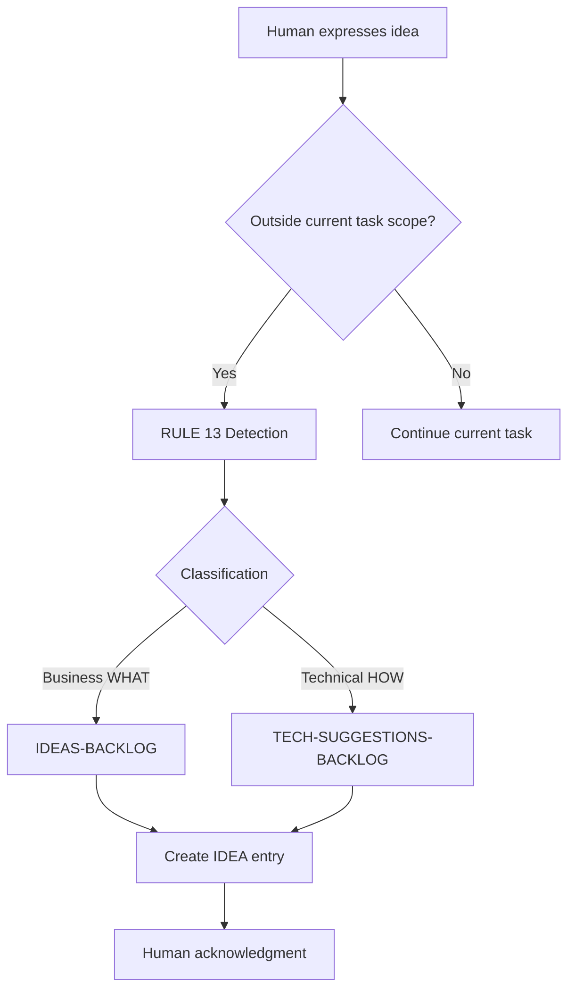
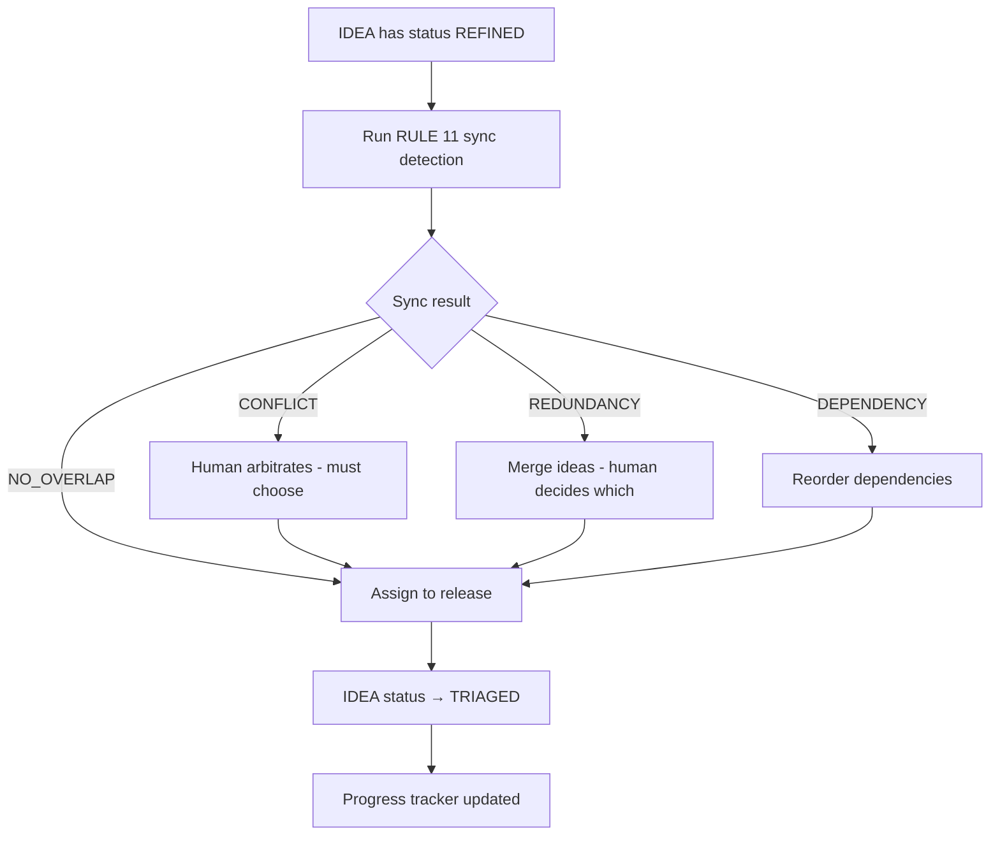
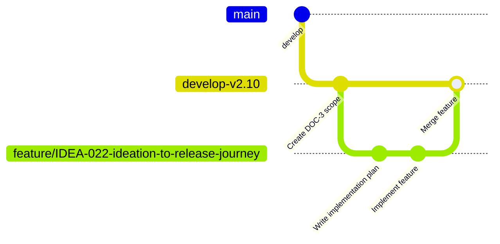
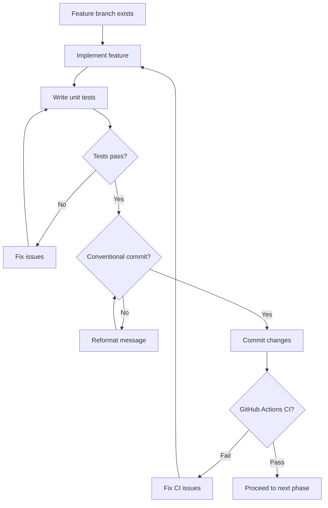
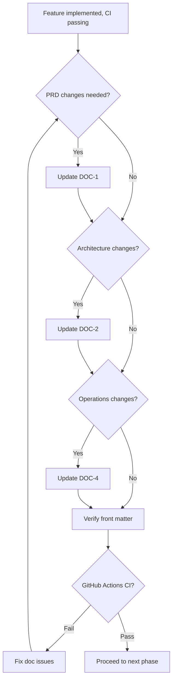
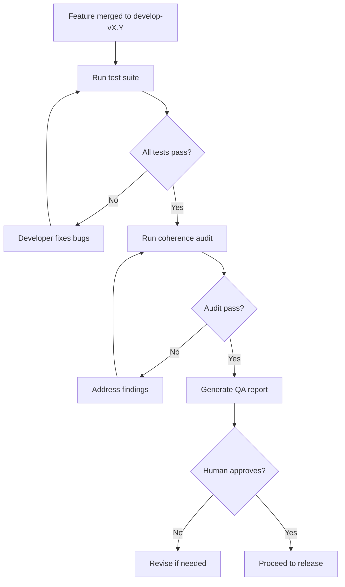
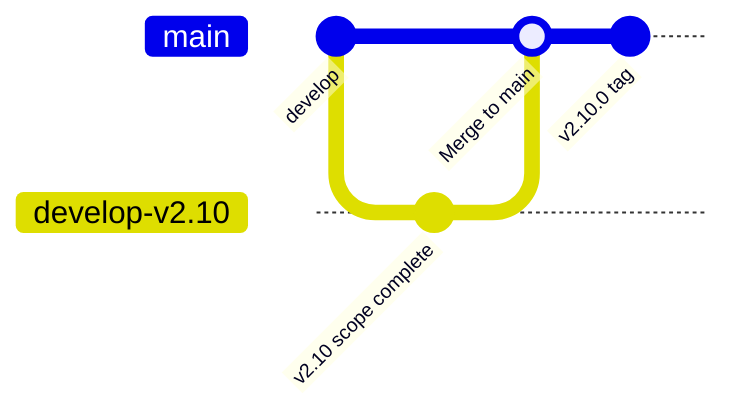

# DOC-4 — Operations Guide (v2.10)

> **Status: DRAFT** -- This document is under construction for v2.10 release.
> **Cumulative: YES** -- This document contains all operations guidance from v1.0 through v2.10.
> To understand the full project operations history, read this document from top to bottom.
> Each section represents a release version. Content grows cumulatively.

---

## Table of Contents

1. [Workbench Deployment Guide](#1-workbench-deployment-guide)
2. [Session Checkpoint Operations](#2-session-checkpoint-operations)
3. [Heartbeat Script Usage](#3-heartbeat-script-usage)
4. [ADR Management](#4-adr-management)
5. [Artifact ID Generation](#5-artifact-id-generation)
6. [Canonical Docs Operations](#6-canonical-docs-operations)
7. [Prompt Registry Operations](#7-prompt-registry-operations)
8. [Script Reference](#8-script-reference)
9. [Troubleshooting Guide](#9-troubleshooting-guide)
10. [v2.9 Operations Additions](#10-v29-operations-additions)
11. [Ideation-to-Release Journey](#11-ideation-to-release-journey) ⬅ NEW in v2.10

---

## 1. Workbench Deployment Guide

### 1.1 Understanding What This Repository Is (and Is Not)

```
agentic-agile-workbench/   ← YOU ARE HERE
│                                     This is the WORKBENCH
│
│  docs/           ← The workbench documentation (DOC1-5)
│  prompts/        ← The workbench tools (system prompts SP-001 to SP-010)
│  proxy.py        ← A workbench machine (Roo Code <-> Gemini Chrome bridge)
│  .roomodes       ← The workbench worker roles (4 Agile personas)
│  .clinerules     ← The workbench rulebook (15 mandatory rules)
│  scripts/        ← The workbench utility scripts
│
└── It produces PROJECTS (separate repositories, in other folders)
```

**This repository contains no application code.** It contains the rules, tools, processes and system prompts that enable developing any project in an agentic, agile and versioned manner.

### 1.2 Deployment Checklist

| Step | Action | Verification | Source |
|------|--------|--------------|--------|
| 1 | Clone repository to local machine | `git clone <repo-url>` | External |
| 2 | Install Python 3.10+ dependencies | `pip install -r requirements.txt` | requirements.txt |
| 3 | Copy template to new project | `.\deploy-workbench-to-project.ps1 -ProjectPath ./my-project` | deploy-workbench-to-project.ps1 |
| 4 | Initialize Git in target project | `cd ./my-project && git init` | External |
| 5 | Configure Roo Code in VS Code | Install Roo Code extension, configure API provider | External |
| 6 | Verify Memory Bank structure | `ls memory-bank/hot-context/` shows 6 files | .clinerules |
| 7 | Test pre-commit hook | `git commit` triggers prompt sync check | .githooks/pre-commit |

### 1.3 Deployment Parameters

```powershell
# Initial deployment
.\deploy-workbench-to-project.ps1 -ProjectPath "C:\path\to\my-project"

# Update existing deployment
.\deploy-workbench-to-project.ps1 -ProjectPath "C:\path\to\my-project" -Update

# Dry run (simulation)
.\deploy-workbench-to-project.ps1 -ProjectPath "C:\path\to\my-project" -DryRun
```

### 1.4 Files Deployed to Target Project

**7 Configuration Files:**
- `.roomodes` — 4 Agile personas
- `.clinerules` — 15 mandatory rules
- `.workbench-version` — Version marker
- `Modelfile` — Ollama configuration
- `proxy.py` — Clipboard proxy v2.8.0
- `requirements.txt` — Python dependencies
- `mcp.json` — Calypso MCP server config

---

## 2. Session Checkpoint Operations

### 2.1 Session Protocol

Every workbench session follows the mandatory CHECK→CREATE→READ→ACT sequence:

1. **CHECK**: Does `memory-bank/hot-context/activeContext.md` exist?
2. **CREATE**: If absent, create `memory-bank/hot-context/activeContext.md` and `memory-bank/hot-context/progress.md`
3. **READ**: Read both files to understand current state
4. **ACT**: Process the user's request

### 2.2 Active Context Structure

```markdown
---
# Active Context

**Last updated:** YYYY-MM-DD
**Active mode:** [code|architect|ask|debug]
**Active LLM backend:** MinMax M2.7 via OpenRouter

## Current task
[Description]

## Completed (This Session)
- [x] Step 1
- [x] Step 2

## Next step(s)
- [ ] Next action

## Last Git commit
[hash] - message
---
```

### 2.3 Session Checkpoint Script

**Source:** `scripts/checkpoint_heartbeat.py`

```bash
# Run checkpoint
python scripts/checkpoint_heartbeat.py

# Options
python scripts/checkpoint_heartbeat.py --dry-run
python scripts/checkpoint_heartbeat.py --force
```

---

## 3. Heartbeat Script Usage

### 3.1 Purpose

The heartbeat script (`checkpoint_heartbeat.py`) monitors session health and creates checkpoints.

### 3.2 Usage

```powershell
# Start heartbeat monitoring
python scripts/checkpoint_heartbeat.py start

# Stop heartbeat
python scripts/checkpoint_heartbeat.py stop

# Status check
python scripts/checkpoint_heartbeat.py status
```

### 3.3 Configuration

| Parameter | Default | Description |
|-----------|---------|-------------|
| interval | 300 | Seconds between checkpoints |
| max_retries | 3 | Retries on failure |
| timeout | 30 | HTTP timeout |

---

## 4. ADR Management

### 4.1 ADR Format

ADRs are stored in `memory-bank/hot-context/decisionLog.md` and are **APPEND ONLY**.

```markdown
## ADR-NNN : Title
**Date :** YYYY-MM-DD
**Statut :** [Accepte|Rejete|En cours]

**Contexte :**
[Background]

**Decision :**
[What was decided]

**Consequences :**
[Outcomes]
```

### 4.2 ADR Lifecycle

| Phase | Action |
|-------|--------|
| Creation | New ADR appended with status `[Propose]` |
| Review | Human reviews and changes status |
| Acceptance | Status changed to `[Accepte]` or `[Rejete]` |

---

## 5. Artifact ID Generation

### 5.1 Session ID Format

```
s{YYYY-MM-DD}-{mode}-{NNN}
```

Example: `s2026-04-08-code-001`

### 5.2 Batch Artifact ID Format

```
BATCH-{YYYY-MM-DD}-{NNNN}
```

Example: `BATCH-2026-04-08-0001`

---

## 6. Canonical Docs Operations

### 6.1 DOC Types

| DOC | Name | Type | Line Minimum |
|-----|------|------|--------------|
| DOC-1 | Product Requirements Document | Cumulative | 500 |
| DOC-2 | Technical Architecture | Cumulative | 500 |
| DOC-3 | Implementation Plan | **Release-Specific** | 100 |
| DOC-4 | Operations Guide | Cumulative | 300 |
| DOC-5 | Release Notes | **Release-Specific** | 50 |

### 6.2 Release-Specific vs Cumulative

- **Cumulative** (DOC-1, DOC-2, DOC-4): Complete history up to vX.Y
- **Release-Specific** (DOC-3, DOC-5): Only this release's content

### 6.3 Pointer Files

Each `DOC-*-CURRENT.md` points to the latest release:
- `docs/DOC-1-CURRENT.md` → `docs/releases/vX.Y/DOC-1-vX.Y-PRD.md`
- `docs/DOC-2-CURRENT.md` → `docs/releases/vX.Y/DOC-2-vX.Y-Architecture.md`
- `docs/DOC-3-CURRENT.md` → `docs/releases/vX.Y/DOC-3-vX.Y-Implementation-Plan.md`
- `docs/DOC-4-CURRENT.md` → `docs/releases/vX.Y/DOC-4-vX.Y-Operations-Guide.md`
- `docs/DOC-5-CURRENT.md` → `docs/releases/vX.Y/DOC-5-vX.Y-Release-Notes.md`

---

## 7. Prompt Registry Operations

### 7.1 Prompt Registry Structure

```
prompts/
├── README.md                    # Registry index
├── SP-001-ollama-modelfile-system.md
├── SP-002-clinerules-global.md
├── SP-003-persona-product-owner.md
├── SP-004-persona-scrum-master.md
├── SP-005-persona-developer.md
├── SP-006-persona-qa-engineer.md
├── SP-007-gem-gemini-roo-agent.md
├── SP-008-synthesizer-agent.md
├── SP-009-devils-advocate-agent.md
└── SP-010-librarian-agent.md
```

### 7.2 Synchronization Check

```powershell
# Run prompt sync check
powershell -ExecutionPolicy Bypass -File scripts/check-prompts-sync.ps1

# Expected output
# [SP-001] ... PASS
# [SP-002] ... PASS
# ...
# SUMMARY: N PASS | M FAIL | K WARN
```

### 7.3 SP-002 Rebuild

When `.clinerules` is modified, SP-002 must be rebuilt:

```bash
python scripts/rebuild_sp002.py
```

---

## 8. Script Reference

### 8.1 Batch Scripts

**Source:** `scripts/batch/`

| Script | Purpose |
|--------|---------|
| `submit.py` | Submit batch API requests |
| `retrieve.py` | Retrieve batch results |
| `poll.py` | Poll batch status |
| `generate.py` | Generate batch scripts |
| `cli.py` | Command-line interface |

### 8.2 Usage Examples

```bash
# Submit batch
python scripts/batch/submit.py --input batch_requests.json

# Poll status
python scripts/batch/poll.py --batch-id BATCH-YYYY-MM-DD-NNNN

# Retrieve results
python scripts/batch/retrieve.py --batch-id BATCH-YYYY-MM-DD-NNNN
```

---

## 9. Troubleshooting Guide

### 9.1 Common Issues

| Issue | Cause | Solution |
|-------|-------|----------|
| Prompt sync FAIL | .clinerules not synced | Run `python scripts/rebuild_sp002.py` |
| Pre-commit hook fails | CRLF line endings | Configure git to use LF |
| Memory Bank not loading | File missing | Check `memory-bank/hot-context/` contents |
| Batch API timeout | Network issue | Increase timeout in `scripts/batch/config.py` |

### 9.2 Git Issues

```bash
# Reset to last known good state
git reset --hard HEAD~1

# Force push (use with caution)
git push --force

# Check git status
git status
```

---

## 10. v2.9 Operations Additions

### 10.1 v2.9 Enrichment Approach

This release focuses on documentation enrichment and clarification. The v2.8 content remains authoritative; v2.7 content is used only to fill gaps where v2.8 is silent.

**Enrichment approach:**
- v2.8 is used as the authoritative base for all content
- v2.7 is consulted only where v2.8 has no coverage
- When both v2.8 and v2.7 cover the same topic, v2.8 wins (more recent and complete)
- Memory Bank directory structure clarification added

### 10.2 v2.9 Scope Summary

| Area | Status | Source |
|------|--------|--------|
| Deployment guide | Unchanged from v2.8 | v2.8 is authoritative |
| Session checkpoint | Unchanged from v2.8 | v2.8 is authoritative |
| Heartbeat script | Unchanged from v2.8 | v2.8 is authoritative |
| ADR management | Unchanged from v2.8 | v2.8 is authoritative |
| Prompt registry | Unchanged from v2.8 | v2.8 is authoritative |
| Script reference | Updated batch command paths | v2.9 scope |
| Troubleshooting | Unchanged from v2.8 | v2.8 is authoritative |

### 10.3 Memory Bank Directory Structure

Complete directory structure for reference:

```
memory-bank/
├── hot-context/                    ← Read at session start
│   ├── activeContext.md           (Current task state)
│   ├── progress.md                (Feature checklist)
│   ├── decisionLog.md              (ADRs - APPEND ONLY)
│   ├── systemPatterns.md           (Architecture conventions)
│   ├── productContext.md           (Business context)
│   └── session-checkpoint.md       (Crash recovery)
├── archive-cold/                   ← MCP tool access ONLY
│   ├── completed-tickets/
│   └── sprint-logs/
└── batch_artifacts/               (Anthropic Batch outputs)
```

---

## 11. Ideation-to-Release Journey

> **NEW in v2.10** — This chapter provides a complete operational reference for the ideation-to-release journey.

### 11.1 Introduction

This chapter documents the complete journey from a raw vague idea to a released feature. It is designed as an operational reference for humans and agents working on the workbench.

**Target audience:** Humans and agents
**How to use:** Follow sequentially or jump to specific phase

### 11.2 Phase 0: Idea Intake

| Field | Value |
|-------|-------|
| **WHO** | Human (initiator), Orchestrator (intake agent) |
| **WHAT** | Raw idea captured in IDEAS-BACKLOG.md or TECH-SUGGESTIONS-BACKLOG.md |
| **WITH WHOM** | Orchestrator routes to appropriate backlog |
| **WHERE** | No Git branch (pre-ideation) |
| **HOW** | Verbal or structured input; RULE 13 (Ideation Intake) |
| **Tools** | Orchestrator intake form |
| **Inputs** | Human raw idea |
| **Outputs** | New IDEA entry with status `[IDEA]` |
| **Rules** | RULE 13 (Ideation Intake) |

**Files Modified:**
- `docs/ideas/IDEAS-BACKLOG.md` OR `docs/ideas/TECH-SUGGESTIONS-BACKLOG.md` (new entry added)
- `docs/conversations/YYYY-MM-DD-orchestrator-intake-IDEA-NNN.md` (conversation log)

**Entry Criteria:**
- Human expresses a new idea, request, or remark
- Input is outside current task scope (RULE 13 detection)

**Exit Criteria:**
- IDEA entry created with status `[IDEA]`
- Backlog file updated with new entry
- Conversation log created
- Human acknowledged with routing confirmation

**Decision Tree:**
```
Is idea business (WHAT)?
├── YES → Route to IDEAS-BACKLOG
└── NO (technical HOW) → Route to TECH-SUGGESTIONS-BACKLOG
```

**Mermaid Diagram:**


### 11.3 Phase 1: Idea Refinement

| Field | Value |
|-------|-------|
| **WHO** | Human (Product Owner), Orchestrator (facilitator), Architect (technical feasibility) |
| **WHAT** | Structured requirements and feasibility assessment |
| **WITH WHOM** | Orchestrator, Architect (if technical) |
| **WHERE** | No Git branch (pre-refinement) |
| **HOW** | Structured refinement session |
| **Inputs** | Raw idea, IDEAS-BACKLOG.md entry |
| **Outputs** | Updated IDEA entry with status `[REFINED]` and structured requirements |
| **Rules** | RULE 13 (Refinement options) |

**Files Modified:**
- `docs/ideas/IDEA-NNN-{slug}.md` (status updated to `[REFINED]`)
- `docs/conversations/REFINEMENT-YYYY-MM-DD-NNN.md` (refinement conversation log)

**Entry Criteria:**
- IDEA has status `[IDEA]`
- Human chooses "Refine Now" option

**Exit Criteria:**
- IDEA status updated to `[REFINED]`
- Structured requirements documented in IDEA file
- Refinement conversation log created
- Human approves final requirements

**Decision Tree:**
```
Human chooses refinement option:
├── [A] Refine Now → Proceed to Phase 2
├── [B] Defer → Mark as [DEFERRED], end journey
└── [C] Sync First → Run sync detection (RULE 11)
    ├── 🔴 CONFLICT → Human arbitrates
    ├── 🟡 REDUNDANCY → Merge ideas
    ├── 🔵 DEPENDENCY → Reorder
    └── 🟢 NO_OVERLAP → Proceed to Phase 2
```

**Mermaid Diagram:**
```mermaid
flowchart TD
    A[IDEA has status IDEA] --> B{Human chooses option}
    B -->|[A] Refine Now| C[Structured refinement session]
    B -->|[B] Defer| D[Mark DEFERRED]
    B -->|[C] Sync First| E[Run RULE 11 sync detection]
    E --> F{Sync result}
    F -->|CONFLICT| G[Human arbitrates]
    F -->|REDUNDANCY| H[Merge ideas]
    F -->|DEPENDENCY| I[Reorder]
    F -->|NO_OVERLAP| C
    G --> C
    H --> C
    I --> C
    C --> J[IDEA status → REFINED]
    J --> K[Human approves requirements]
```

### 11.4 Phase 2: Triage and Release Assignment

| Field | Value |
|-------|-------|
| **WHO** | Human (Product Owner), Orchestrator (sync detector) |
| **WHAT** | Idea triaged and assigned to release |
| **WITH WHOM** | Orchestrator (sync detection) |
| **WHERE** | No Git branch |
| **HOW** | Triage dashboard, sync detection |
| **Inputs** | Refined IDEA, current release backlog |
| **Outputs** | IDEA assigned to release (e.g., v2.11), status `[TRIAGED]` |
| **Rules** | RULE 11 (Synchronization Awareness) |

**Files Modified:**
- `docs/ideas/IDEA-NNN-{slug}.md` (status updated to `[TRIAGED]`, release assigned)
- `memory-bank/hot-context/progress.md` (checkbox added for new IDEA)

**Entry Criteria:**
- IDEA has status `[REFINED]`
- Sync detection completed (RULE 11)

**Exit Criteria:**
- IDEA assigned to target release
- IDEA status updated to `[TRIAGED]`
- Any conflicts resolved by human
- Progress tracker updated

**Decision Tree:**
```
Sync detection results:
├── 🔴 CONFLICT → Human must arbitrate
├── 🟡 REDUNDANCY → Merge into single idea
├── 🔵 DEPENDENCY → Reorder, Idea B needs Idea A first
└── 🟢 NO_OVERLAP → Proceed with assignment
```

**Mermaid Diagram:**


### 11.5 Phase 3: Implementation Planning

| Field | Value |
|-------|-------|
| **WHO** | Developer, Architect |
| **WHAT** | Implementation plan created |
| **WITH WHOM** | Architect (for complex features) |
| **WHERE** | `develop-vX.Y` branch |
| **HOW** | Feature branch created, implementation planned |
| **Inputs** | Triaged IDEA, DOC-3 (release-specific) |
| **Outputs** | `feature/IDEA-NNN-slug` branch, updated DOC-3 |
| **Rules** | RULE 10 (GitFlow), RULE 12 (Canonical Docs) |

**Files Modified:**
- `docs/releases/vX.Y/DOC-3-vX.Y-Implementation-Plan.md` (IDEA added to scope)

**Files Created:**
- `feature/IDEA-NNN-{slug}` branch (from `develop-vX.Y`)
- `plans/IDEA-NNN/PLAN-IDEA-NNN-{slug}.md` (implementation plan)

**Entry Criteria:**
- IDEA has status `[TRIAGED]`
- Release branch `develop-vX.Y` exists or will be created

**Exit Criteria:**
- Feature branch `feature/IDEA-NNN-{slug}` created
- DOC-3 updated with IDEA in scope
- Implementation plan written and approved

**Mermaid Diagram:**


### 11.6 Phase 4: Development

| Field | Value |
|-------|-------|
| **WHO** | Developer |
| **WHAT** | Feature implemented and committed |
| **WITH WHOM** | QA Engineer (for testing) |
| **WHERE** | `feature/IDEA-NNN-slug` branch |
| **HOW** | Code implementation, unit tests, commit on feature branch |
| **Inputs** | Feature branch, implementation plan |
| **Outputs** | Committed changes on feature branch |
| **Rules** | RULE 10 (GitFlow), Git commit conventions |

**Files Modified:**
- Source code files (`.py`, `.md`, `.ps1`, etc.)
- Test files (`src/calypso/tests/*.py`)

**Files Created:**
- New source files as needed by implementation

**Entry Criteria:**
- Feature branch exists
- Implementation plan approved

**Exit Criteria:**
- All code implemented
- Unit tests written and passing
- Commits made with Conventional Commits format
- GitHub Actions CI passing

**Commit Message Format:**
```
<type>(<scope>): <description>

feat(scope): new feature
fix(scope): bug fix
docs(scope): documentation
chore(scope): configuration
refactor(scope): refactoring
test(scope): tests
```

**Mermaid Diagram:**


### 11.7 Phase 5: Documentation

| Field | Value |
|-------|-------|
| **WHO** | Developer, Architect |
| **WHAT** | Canonical docs updated (DOC-1, DOC-2, DOC-4) |
| **WITH WHOM** | Product Owner (for requirements clarification) |
| **WHERE** | `feature/IDEA-NNN-slug` branch |
| **HOW** | Update cumulative docs per release scope |
| **Inputs** | Feature implementation, DOC-1/DOC-2/DOC-4 |
| **Outputs** | Updated canonical docs on feature branch |
| **Rules** | RULE 12 (Canonical Docs) |

**Files Modified:**
- `docs/releases/vX.Y/DOC-1-vX.Y-PRD.md` (if PRD changes needed)
- `docs/releases/vX.Y/DOC-2-vX.Y-Architecture.md` (if architecture changes needed)
- `docs/releases/vX.Y/DOC-4-vX.Y-Operations-Guide.md` (if operations changes needed)

**Entry Criteria:**
- Feature implementation complete
- Feature branch has passing CI

**Exit Criteria:**
- All affected cumulative docs updated
- DOCs have correct front matter (`cumulative: true`)
- GitHub Actions CI passes

**Mermaid Diagram:**


### 11.8 Phase 6: QA and Validation

| Field | Value |
|-------|-------|
| **WHO** | QA Engineer |
| **WHAT** | Feature validated and tested |
| **WITH WHOM** | Developer (for bug fixes) |
| **WHERE** | `feature/IDEA-NNN-slug` branch |
| **HOW** | Test execution, coherence audit, QA report |
| **Inputs** | Feature branch, test suite |
| **Outputs** | QA report, test results |
| **Rules** | RULE 8 (QA Validation) |

**Files Modified:**
- `docs/qa/vX.Y/QA-REPORT-vX.Y.md` (QA report updated)

**Files Created:**
- `docs/qa/vX.Y/submit_batch*.py` (batch test scripts if needed)

**Entry Criteria:**
- Feature branch merged to `develop-vX.Y`
- All code commits on feature branch

**Exit Criteria:**
- QA report generated and approved
- All tests passing
- Coherence audit passed (if required)
- Human approves QA results

**Mermaid Diagram:**


### 11.9 Phase 7: Release

| Field | Value |
|-------|-------|
| **WHO** | Scrum Master (merge coordination) |
| **WHAT** | Feature merged and released |
| **WITH WHOM** | Developer, Product Owner (approval) |
| **WHERE** | `develop-vX.Y` → `develop` → `main` |
| **HOW** | PR merge, tag creation, release |
| **Inputs** | Feature branch, QA approval |
| **Outputs** | Merged to develop, tagged release |
| **Rules** | RULE 10 (GitFlow), RULE 12 (Canonical Docs) |

**Files Modified:**
- `docs/DOC-*-CURRENT.md` (pointers updated after release)
- `memory-bank/hot-context/progress.md` (IDEA checkbox marked complete)
- `memory-bank/hot-context/activeContext.md` (updated for next task)

**Files Created:**
- Release tag `vX.Y.0` on `main`
- `docs/releases/vX.Y/DOC-*-vX.Y-*.md` (frozen docs after release)

**Entry Criteria:**
- QA approved
- All checks passing
- Human approves release

**Exit Criteria:**
- Fast-forward merge to `develop` completed
- Tag `vX.Y.0` pushed to origin
- DOC-*-CURRENT.md pointers updated
- Memory Bank updated

**Decision Tree:**
```
All checks pass?
└── YES → Merge to develop-vX.Y

develop-vX.Y scope complete?
└── YES → Merge to develop

develop stable?
└── YES → Tag vX.Y.0 on main
```

**Mermaid Diagram:**


### 11.10 Decision Trees Summary

#### Intake Decision Tree
```
Human expresses idea
    ↓
Is it outside current task scope? (RULE 13)
    ↓
Is it business (WHAT) or technical (HOW)?
    ↓
Route to IDEAS-BACKLOG or TECH-SUGGESTIONS-BACKLOG
```

#### Refinement Decision Tree
```
IDEA has status [IDEA]
    ↓
Human chooses: [A] Refine Now | [B] Defer | [C] Sync First
    ↓
[A] → Structured refinement → [REFINED]
[B] → Mark [DEFERRED]
[C] → Run sync detection → Resolve conflicts → [REFINED]
```

#### Triage Decision Tree
```
IDEA has status [REFINED]
    ↓
Run RULE 11 sync detection
    ↓
🔴 CONFLICT → Human arbitrates
🟡 REDUNDANCY → Merge ideas
🔵 DEPENDENCY → Reorder
🟢 NO_OVERLAP → Assign to release → [TRIAGED]
```

#### Release Decision Tree
```
All checks pass?
    ↓
Merge to develop-vX.Y
    ↓
develop-vX.Y complete?
    ↓
Merge to develop
    ↓
Tag vX.Y.0 on main
```

---

**End of DOC-4 Operations Guide (v2.10)**
