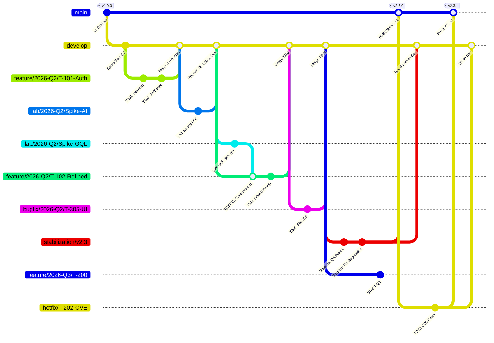

# System Patterns

## Directory Architecture
[Paste your project directory tree here]

## Naming Conventions
- Files: [convention, e.g.: kebab-case]
- Variables: [convention, e.g.: camelCase]
- Classes: [convention, e.g.: PascalCase]
- Constants: [convention, e.g.: UPPER_SNAKE_CASE]

## Adopted Technical Patterns
- [Pattern 1: e.g.: Repository Pattern for data access]
- [Pattern 2: e.g.: Service Layer for business logic]

## Anti-Patterns to Avoid
- [Anti-pattern 1]

## Refining Workflow (Strategy B)

The **Refining Workflow** (Strategy B from TECH-004) enables experimental lab work to be refined into production features through a Z-pattern workflow: `lab → feature → develop`.

### Z-Pattern: lab → feature → develop

The Z-pattern describes the git merge path for Strategy B:

1. **lab/{Timebox}/{slug}** — Experimental spike, branched from `develop`
2. **feature/{Timebox}/{IDEA-NNN}-{slug}** — Refined feature, branched from `develop`, consumes lab via merge
3. **develop** — Receives refined feature via PR merge

This pattern preserves traceability from experiment to product while keeping experimental work isolated until production-ready.

### Branch Naming Conventions

| Branch Type | Pattern | Example |
|-------------|---------|---------|
| Feature | `feature/{Timebox}/{IDEA-NNN}-{slug}` | `feature/2026-Q2/IDEA-101-authentication` |
| Lab (Spike) | `lab/{Timebox}/{slug}` | `lab/2026-Q2/Spike-GraphQL` |
| Bugfix | `bugfix/{Timebox}/{Ticket}-{slug}` | `bugfix/2026-Q2/T-305-UI-Align` |
| Hotfix | `hotfix/{Ticket}` | `hotfix/T-202-DB-Leak` |
| Stabilization | `stabilization/vX.Y` | `stabilization/v2.3` |

> **Note:** `stabilization/vX.Y` replaces the previous `release/vX.Y.Z` concept. Stabilization is NOT timeboxed — it is a permanent artifact that exists until the release is published to `main`.
