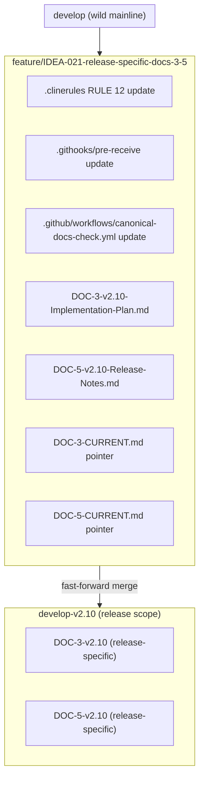

# PLAN: IDEA-021 — Release-Specific DOC-3 and DOC-5

**Author:** Architect (mode: architect)  
**Created:** 2026-04-02  
**IDEA:** IDEA-021  
**Target Release:** v2.10  
**Status:** Draft — Awaiting Human Approval

---

## 1. Context

**Problem:** All 5 canonical docs are currently treated as cumulative (RULE 12), but:
- **DOC-3 (Implementation Plan)** — Should document THIS release's scope, not repeat historical plans
- **DOC-5 (Release Notes)** — By definition, should document what changed in THIS release only

**Decision:** DOC-3 and DOC-5 become **release-specific** starting v2.10. DOC-1, DOC-2, DOC-4 remain cumulative.

**Refinements accepted:**
- DOC-3 includes brief cross-references to previous releases' key decisions
- DOC-5 is standalone (no external links to PRs/changesets in the doc itself)
- No separate changelog doc (deferred as potential future work)

---

## 2. Scope of Changes

### 2.1 Files Modified

| File | Change |
|------|--------|
| `.clinerules` | RULE 12 modification: DOC-3/DOC-5 release-specific |
| `template/.clinerules` | RULE 12 modification (synced) |
| `prompts/SP-002-clinerules-global.md` | RULE 12 modification (synced) |
| `.githooks/pre-receive` | Enforcement: release-specific line count thresholds for DOC-3/DOC-5 |
| `.github/workflows/canonical-docs-check.yml` | CI: release-specific validation for DOC-3/DOC-5 |
| `docs/releases/v2.10/DOC-3-v2.10-Implementation-Plan.md` | **NEW** — release-specific |
| `docs/releases/v2.10/DOC-5-v2.10-Release-Notes.md` | **NEW** — release-specific |
| `docs/DOC-3-CURRENT.md` | Pointer updated to v2.10 |
| `docs/DOC-5-CURRENT.md` | Pointer updated to v2.10 |

### 2.2 Files NOT Changed (Cumulative Remain)

| File | Reason |
|------|--------|
| `docs/releases/v2.10/DOC-1-v2.10-PRD.md` | Cumulative — not in scope |
| `docs/releases/v2.10/DOC-2-v2.10-Architecture.md` | Cumulative — not in scope |
| `docs/releases/v2.10/DOC-4-v2.10-Operations-Guide.md` | Cumulative — not in scope |

---

## 3. Detailed Implementation Steps

### PHASE A: Feature Branch Setup

- [ ] Create feature branch `feature/IDEA-021-release-specific-docs-3-5` from `develop`

### PHASE B: RULE 12 Modification (3 files must be synced)

- [ ] **`.clinerules`** — Update RULE 12:
  - R-CANON-0: Cumulative applies ONLY to DOC-1, DOC-2, DOC-4
  - R-CANON-1: DOC-3 is release-specific — only this release's implementation scope
  - R-CANON-2: DOC-5 is release-specific — only this release's changes
  - R-CANON-3: Historical DOC-3 and DOC-5 preserved in `docs/releases/vX.Y/`
  - Remove/minimize line count requirements for DOC-3 and DOC-5 (or set very low threshold)
  - Update minimum line counts: DOC-1 >= 500, DOC-2 >= 500, DOC-3 >= 100 (release-specific), DOC-4 >= 300, DOC-5 >= 50 (release-specific)

- [ ] **`template/.clinerules`** — Sync RULE 12 changes (byte-for-byte match with .clinerules)

- [ ] **`prompts/SP-002-clinerules-global.md`** — Run `python scripts/rebuild_sp002.py` after .clinerules update

### PHASE C: Enforcement Updates

- [ ] **`.githooks/pre-receive`** — Update:
  - DOC-3/DOC-5: Lower line count thresholds (e.g., 100 and 50 respectively)
  - Add logic: if cumulative: false in front matter, skip cumulative check
  - Or: check cumulative flag in front matter, validate accordingly

- [ ] **`.github/workflows/canonical-docs-check.yml`** — Update:
  - Check `cumulative:` flag per-document instead of assuming all are cumulative
  - Apply release-specific line count thresholds for DOC-3/DOC-5
  - Validate: DOC-3/DOC-5 should have `cumulative: false` or no cumulative flag

### PHASE D: Create v2.10 Release-Specific Docs

- [ ] **Create `docs/releases/v2.10/` directory**

- [ ] **Create `DOC-3-v2.10-Implementation-Plan.md`:**
  - Front matter: `cumulative: false`, `release-specific: true`
  - Content: ONLY v2.10 implementation scope
  - Include brief cross-references to previous releases' key decisions (e.g., "Decision from v2.8: ...")
  - Line target: 100-300 lines (release-specific, not cumulative)
  - Sections:
    1. v2.10 Release Scope (IDEA list)
    2. Key Implementation Decisions (with cross-refs)
    3. Execution Tracking (how to track progress)
    4. Dependencies and Risks

- [ ] **Create `DOC-5-v2.10-Release-Notes.md`:**
  - Front matter: `cumulative: false`, `release-specific: true`
  - Content: ONLY v2.10 changes (no links to PRs/changesets)
  - Line target: 50-150 lines (release-specific, not cumulative)
  - Sections:
    1. What's New in v2.10
    2. Breaking Changes (if any)
    3. Bug Fixes
    4. Known Issues

### PHASE E: Update CURRENT Pointers

- [ ] **Update `docs/DOC-3-CURRENT.md`:**
  - Change release to v2.10
  - Point to `docs/releases/v2.10/DOC-3-v2.10-Implementation-Plan.md`
  - Status: Draft (since v2.10 not yet released)

- [ ] **Update `docs/DOC-5-CURRENT.md`:**
  - Change release to v2.10
  - Point to `docs/releases/v2.10/DOC-5-v2.10-Release-Notes.md`
  - Status: Draft

### PHASE F: Validation

- [ ] Run `python scripts/check-prompts-sync.ps1` — SP-002 must match .clinerules
- [ ] Run GitHub Actions CI locally (if available) or verify YAML syntax
- [ ] Verify `.githooks/pre-receive` syntax

### PHASE G: Git Operations

- [ ] Commit all changes to `feature/IDEA-021-release-specific-docs-3-5`
- [ ] Fast-forward merge to `develop`
- [ ] Update Memory Bank:
  - `memory-bank/hot-context/activeContext.md`
  - `memory-bank/hot-context/progress.md`
  - `memory-bank/hot-context/decisionLog.md` (ADR for the decision)

---

## 4. Mermaid: GitFlow



---

## 5. Line Count Changes

| Doc | Before (cumulative) | After (release-specific) | Rationale |
|-----|---------------------|---------------------------|-----------|
| DOC-3 | >= 300 lines | >= 100 lines | Release-specific scope, not cumulative history |
| DOC-5 | >= 200 lines | >= 50 lines | Standalone release notes, not cumulative changelog |

**Cumulative docs (unchanged):**
| Doc | Minimum Lines |
|-----|---------------|
| DOC-1 | >= 500 |
| DOC-2 | >= 500 |
| DOC-4 | >= 300 |

---

## 6. Front Matter Format

### Release-Specific DOC-3/DOC-5:
```yaml
---
release: v2.10
type: release-specific
cumulative: false
---
```

### Cumulative DOC-1/DOC-2/DOC-4 (unchanged):
```yaml
---
release: v2.10
type: cumulative
cumulative: true
---
```

---

## 7. Human Approvals Needed

- [ ] Approve feature branch creation
- [ ] Approve RULE 12 modification (3 files synced)
- [ ] Approve enforcement updates
- [ ] Approve v2.10 DOC-3 and DOC-5 content
- [ ] Approve final merge to develop

---

## 8. Notes

- v2.9 and earlier docs remain as-is (cumulative) for backward compatibility
- Historical DOC-3 and DOC-5 preserved in their respective `docs/releases/vX.Y/` directories
- This plan does NOT create v2.10 DOC-1, DOC-2, DOC-4 (those are cumulative and not in scope)
