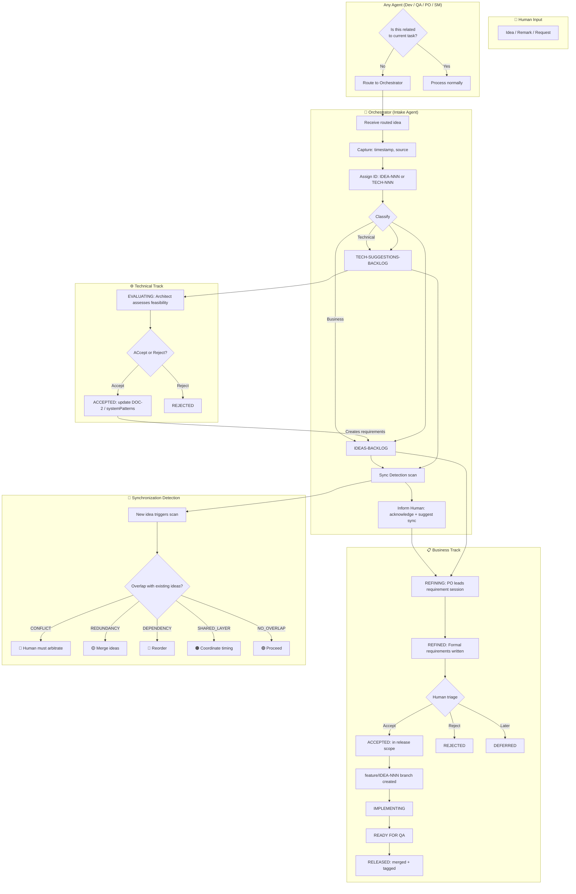
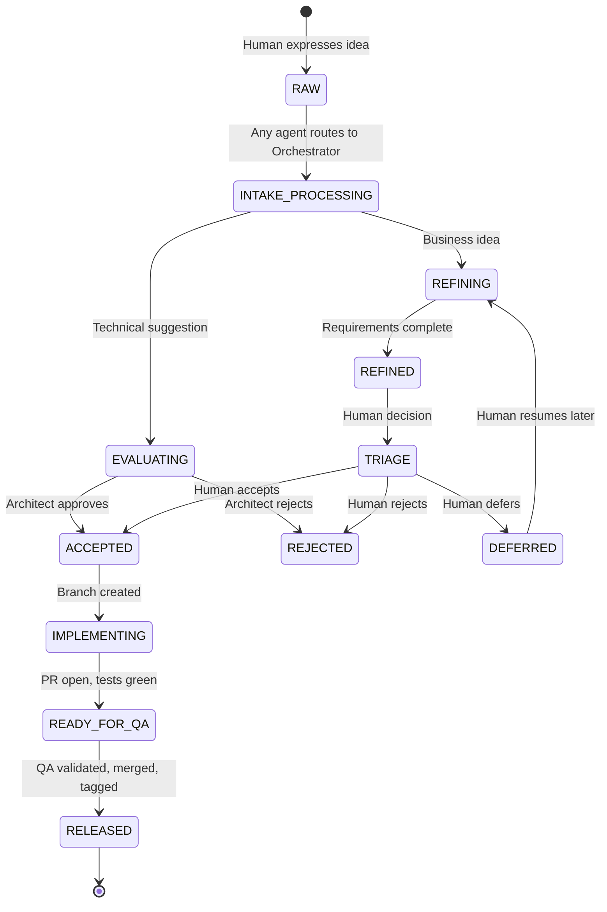
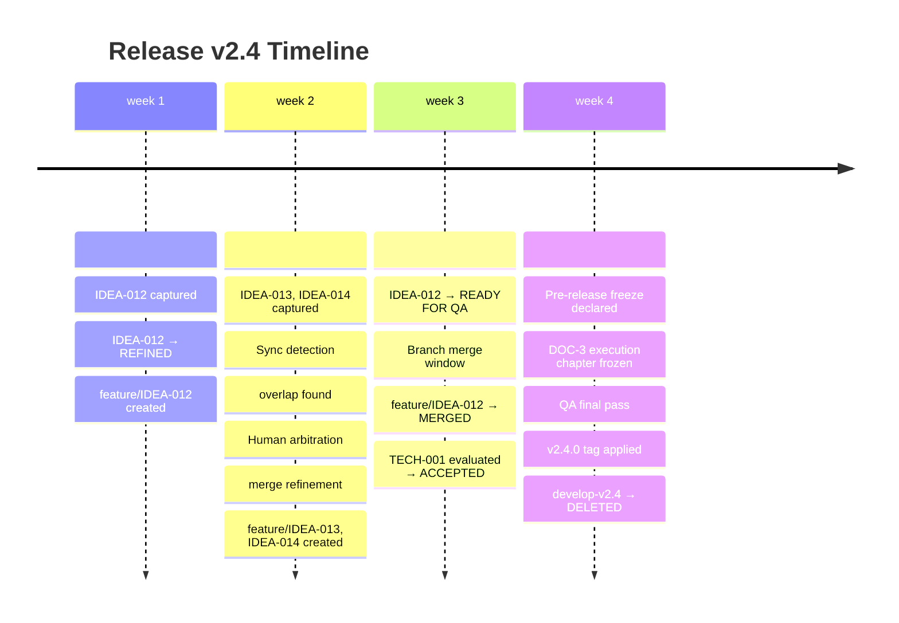

# PLAN: Ideation-to-Release — Complete Ad-Hoc Idea Governance

**Document ID:** PLAN-ideation-to-release  
**Version:** 1.0  
**Status:** Draft — For User Review  
**Date:** 2026-03-30  
**Author:** Architect mode  
**Branch:** develop  

---

## Table of Contents

1. [Executive Summary](#1-executive-summary)
2. [The Problem This Solves](#2-the-problem-this-solves)
3. [Core Principle: Any Agent, One Intake](#3-core-principle-any-agent-one-intake)
4. [Dual-Track Architecture](#4-dual-track-architecture)
5. [Idea State Machine](#5-idea-state-machine)
6. [The Orchestrator as Intake Agent](#6-the-orchestrator-as-intake-agent)
7. [Refinement Workflows](#7-refinement-workflows)
8. [Synchronization Detection System](#8-synchronization-detection-system)
9. [Release Synchronization Points](#9-release-synchronization-points)
10. [DOC-3 Execution Tracking Chapter](#10-doc-3-execution-tracking-chapter)
11. [GitFlow Integration](#11-gitflow-integration)
12. [.clinerules Additions](#12-clinerules-additions)
13. [New Files Created](#13-new-files-created)
14. [Mermaid Diagrams](#14-mermaid-diagrams)

---

## 1. Executive Summary

This plan extends the existing governance model (ADR-006 GitFlow + ADR-010 Ad-Hoc process) to handle the **fuzzy front-end**: the continuous, ad-hoc arrival of ideas, remarks, and requests from humans at any moment during development.

**Key additions:**
- Any agent can detect and re-route off-topic ideas to the Orchestrator
- Orchestrator acts as **Intake Agent** — captures, assigns ID, routes to correct track
- **Dual-track backlog**: Business Requirements (IDEAS-BACKLOG) + Technical Suggestions (TECH-SUGGESTIONS-BACKLOG)
- **Full state machine**: RAW → REFINING → REFINED → ACCEPTED/REJECTED/DEFERRED → implemented
- **Real-time synchronization detection** — flag conflicts/redundancies between parallel ideas
- **Release synchronization points** — periodic merge windows for parallel feature branches
- **DOC-3 live execution chapter** — always up-to-date implementation tracking

---

## 2. The Problem This Solves

### 2.1 The Gap in the Current Model

The current governance model (ADR-006 + ADR-010) handles:
- ✅ Structured ideas from PRD
- ✅ Ad-hoc ideas via ADR-010 triage
- ✅ GitFlow branching (develop / develop-vX.Y / main)
- ✅ 5-canonical-doc process

The current model **does NOT handle**:
- ❌ Continuous, asynchronous arrival of ideas during active development
- ❌ Multiple parallel ideas at different maturity levels simultaneously
- ❌ Real-time conflict detection between ideas in parallel development
- ❌ Technical suggestions routing (tech_parking_lot.md was designed but never implemented)
- ❌ A dedicated Intake Agent that greets every human input
- ❌ Live execution tracking in DOC-3 at all times

### 2.2 Real-World Scenario This Enables

```
Day 1: Human has IDEA-012 (batch retry logic) during v2.3 development
        → Captured, routed to IDEAS-BACKLOG, refinement scheduled async
        
Day 3: Human has IDEA-013 (tech: use Redis for caching) while IDEA-012 is refining
        → Captured, routed to TECH-SUGGESTIONS-BACKLOG
        
Day 5: Human has IDEA-014 (feature: dashboard) while IDEA-012 and IDEA-013 are in parallel
        → Orchestrator detects: IDEA-014 and IDEA-013 may overlap (both need data layer)
        → Human informed of potential sync opportunity
        
Day 7: Human accepts sync suggestion — merged refinement session scheduled
        → Conflicts resolved, single coherent plan emerges
        
Day 10: All three ideas ready for release scope decision
        → Synchronization Point: merge parallel branches or combine into single release
```

---

## 3. Core Principle: Any Agent, One Intake

### 3.1 The Rule

> **RULE [NEW]: Every human input is greeted by an agent. Any agent can detect ideas unrelated to its current work and route them. The Orchestrator is the single intake destination for off-topic ideas.**

### 3.2 Routing Logic

When any agent receives a human input, it evaluates:

```
Is this input directly related to my current task?
├── YES → Process normally, but log any tangential ideas
└── NO  → Route to Orchestrator for intake processing
```

**Examples:**
- Developer agent is coding IDEA-012 → human mentions "we should add export to PDF" → Developer routes to Orchestrator
- QA agent is testing → human mentions "the batch API should have retries" → QA routes to Orchestrator
- Scrum Master is running standup → human has a new feature idea → Scrum Master routes to Orchestrator

### 3.3 What Happens at Intake

The Orchestrator (as Intake Agent) performs:

1. **Capture** — Log the raw idea with timestamp, source agent, source context
2. **Assign ID** — Next sequential IDEA number (IDEA-012, IDEA-013, etc.)
3. **Classify** — Is this a business requirement or a technical suggestion?
4. **Route** — Add to appropriate backlog (IDEAS-BACKLOG or TECH-SUGGESTIONS-BACKLOG)
5. **Inform Human** — Acknowledge receipt, explain routing, set expectations
6. **Detect Sync** — Scan existing backlogs for potential conflicts/redundancies
7. **Suggest Sync** — If sync opportunity found, propose to human

---

## 4. Dual-Track Architecture

### 4.1 Two Separate Backlogs

| Track | File | Contains | Refined Into |
|-------|------|----------|--------------|
| **Business Requirements** | `docs/ideas/IDEAS-BACKLOG.md` | Product features, user needs, business rules | DOC-1 (PRD) requirements |
| **Technical Suggestions** | `docs/ideas/TECH-SUGGESTIONS-BACKLOG.md` | Implementation proposals, architectural hints, "how" ideas | DOC-2 (Architecture) updates |

### 4.2 Why Two Tracks?

The original DOC6 design introduced `tech_parking_lot.md` to:
- **Psychological reassurance**: Human feels heard when they propose a technical solution
- **Separation of concerns**: "What" (business) stays pure, "How" (technical) is parked separately
- **Later consumption**: Technical suggestions can be evaluated by Architecture Agent in Phase 2

This design **revives the tech_parking_lot concept** as a persistent, formal backlog.

### 4.3 The Tech Suggestions Backlog File

Location: `docs/ideas/TECH-SUGGESTIONS-BACKLOG.md`

```markdown
# Technical Suggestions Backlog

**Last triage:** 2026-03-30
**Next triage:** At v2.4 release planning

## How to Use

- Technical suggestions are "How" proposals from humans or agents
- They are parked here, NOT injected into PRD
- At architecture review time, the Architect evaluates each suggestion
- Accepted suggestions update systemPatterns.md and/or DOC-2
- This file is NOT part of the 5 canonical docs — it feeds them

## Status Legend

| Status | Meaning |
|--------|---------|
| `[SUGGESTED]` | Captured, not yet evaluated |
| `[EVALUATING]` | Architect is analyzing feasibility |
| `[ACCEPTED]` | Approved for next architecture update |
| `[REJECTED]` | Will not implement (reason documented) |
| `[INTEGRATED]` | Incorporated into DOC-2 or systemPatterns.md |

## Backlog

| ID | Title | Source | Captured | Status | Evaluation | Disposition |
|----|-------|--------|----------|--------|------------|-------------|
| TECH-001 | Use Redis for batch result caching | Human 2026-03-30 | 2026-03-30 | [SUGGESTED] | — | Pending architecture review |
```

### 4.4 Individual TECH-SUGGESTION-NNN.md File

Each technical suggestion has its own file:

```markdown
---
id: TECH-001
title: Use Redis for batch result caching
status: SUGGESTED
source: Human (Developer mode session)
captured: 2026-03-30
captured_by: Orchestrator Agent
---

## Raw Suggestion

"I think we should use Redis to cache batch API results so we don't poll every time."

## Classification

Type: [TECHNICAL] — This is a "How" not a "What"

## Evaluation (to be filled by Architect)

**Feasibility:** [Pending]
**Impact:** [Pending]
**Risk:** [Pending]

## Routing Decision

This suggestion relates to: IDEA-013 (batch retry logic)
Synchronization recommended: YES
```

---

## 5. Idea State Machine

### 5.1 Complete State Diagram

```
                    ┌──────────────────────────────────────────────────────┐
                    │                      RAW IDEA                        │
                    │  (captured by any agent, routed to Orchestrator)      │
                    └──────────────────────┬───────────────────────────────┘
                                           │
                          ┌────────────────▼────────────────┐
                          │           INTAKE PROCESSING       │
                          │  • Assign ID (IDEA-NNN / TECH-NNN)│
                          │  • Classify (business / technical)│
                          │  • Route to correct backlog      │
                          │  • Sync detection scan            │
                          │  • Inform human                   │
                          └────────────────┬─────────────────┘
                                           │
                    ┌──────────────────────┴──────────────────────┐
                    │                                             │
          ┌─────────▼─────────┐                         ┌─────────▼─────────┐
          │  BUSINESS TRACK  │                         │ TECHNICAL TRACK   │
          │  (IDEAS-BACKLOG) │                         │ (TECH-SUGGESTIONS)│
          └─────────┬─────────┘                         └─────────┬─────────┘
                    │                                             │
                    ▼                                             ▼
          ┌─────────────────┐                           ┌─────────────────┐
          │    REFINING     │                           │   EVALUATING    │
          │ (PRD refinement)│                           │ (Architecture   │
          │ • Discussion    │                           │  feasibility)   │
          │ • Requirements  │                           │                 │
          │ • Acceptance    │                           │                 │
          │   criteria      │                           │                 │
          └────────┬────────┘                           └────────┬────────┘
                   │                                             │
          ┌────────┴────────┐                           ┌─────────┴────────┐
          │                │                           │                 │
    ┌─────▼─────┐    ┌─────▼─────┐              ┌──────▼─────┐   ┌──────▼──────┐
    │ REFINED   │    │ DEFERRED  │              │ ACCEPTED   │   │  REJECTED   │
    │ (Ready for│    │ (Parked for│              │ (Approved  │   │  (Will not  │
    │  triage)  │    │  later)   │              │  arch update)│  │   implement)│
    └─────┬─────┘    └───────────┘              └──────┬─────┘   └─────────────┘
          │                                             │
          ▼                                             ▼
    ┌───────────┐                                 ┌────────────┐
    │ TRIAGE    │                                 │ DOC-2 /    │
    │ (Human    │                                 │ system     │
    │  decides) │                                 │ patterns   │
    └─────┬─────┘                                 │ updated    │
          │                                       └────────────┘
    ┌─────┴─────┐
    │           │
┌───▼───┐  ┌───▼───┐  ┌────────┐
│ACCEPT │  │REJECT │  │DEFERRED│
│(Scope)│  │(Never)│  │(Later) │
└───┬───┘  └───────┘  └────────┘
    │
    ▼
┌─────────────────┐
│ ACCEPTED        │
│ (In release     │
│  backlog)       │
│                 │
│ Branch created: │
│ feature/IDEA-NNN │
└────────┬────────┘
         │
         ▼
┌─────────────────┐
│ IMPLEMENTING    │
│ (on feature     │
│  branch)        │
└────────┬────────┘
         │
         ▼
┌─────────────────┐
│ READY FOR QA    │
│ (PR created,    │
│  tests written)│
└────────┬────────┘
         │
         ▼
┌─────────────────┐
│    RELEASED     │
│ (Merged, tagged,│
│  DOC-1..DOC-5   │
│  updated)       │
└─────────────────┘
```

### 5.2 State Definitions

| State | Description | Who Transitions | When |
|-------|-------------|----------------|------|
| `RAW` | Initial capture | Any agent | Human expresses idea |
| `INTAKE_PROCESSING` | Orchestrator processing | Orchestrator | Idea received |
| `REFINING` | Business requirements being formalized | PO + Human | After intake |
| `EVALUATING` | Technical suggestion being assessed | Architect | After intake |
| `REFINED` | Requirements complete, awaiting triage | PO | Refinement done |
| `ACCEPTED` | Approved for next release scope | Human | At triage |
| `REJECTED` | Will never implement | Human | At triage |
| `DEFERRED` | Good idea, not this release | Human | At triage |
| `IMPLEMENTING` | Feature branch active development | Developer | After accepted |
| `READY_FOR_QA` | PR open, tests complete | Developer | Implementation done |
| `RELEASED` | Merged, tagged, docs updated | Scrum Master | Release complete |

### 5.3 Transitions

**Refinement options given to Human at `REFINING`:**
- "I can refine this now to get a formal requirement for the PRD"
- "This can wait — I'll park it as [DEFERRED] until later"
- "Something is already in progress that overlaps — let me sync first"

---

## 6. The Orchestrator as Intake Agent

### 6.1 Responsibilities

The Orchestrator Agent (SP-008 + existing Calypso orchestrator) gains **Intake Agent** responsibilities:

1. **Idea Reception** — Receive routed ideas from any agent
2. **Capture & ID Assignment** — Log with timestamp, assign next IDEA/TECH number
3. **Classification** — Is it business (WHAT) or technical (HOW)?
4. **Backlog Routing** — Add to IDEAS-BACKLOG or TECH-SUGGESTIONS-BACKLOG
5. **Sync Detection** — Scan existing backlogs for overlaps/conflicts
6. **Human Notification** — Acknowledge idea, explain routing, suggest sync if needed
7. **Refinement Scheduling** — Offer to schedule refinement session or defer

### 6.2 Intake Conversation Template

When the Orchestrator receives an idea from another agent:

```
[IDEA DETECTED by Developer agent]
Human said: "We should add a PDF export feature"

[ORCHESTRATOR INTAKE PROCESS]
━━━━━━━━━━━━━━━━━━━━━━━━━━━━━
✅ Captured: IDEA-015
📁 Route: BUSINESS REQUIREMENT → docs/ideas/IDEAS-BACKLOG.md
📝 Status: [IDEA] — Awaiting refinement

🔍 Sync Detection:
   • IDEA-008 (OpenRouter MinMax) — NO OVERLAP
   • IDEA-012 (batch retry) — NO OVERLAP  
   • TECH-001 (Redis caching) — POTENTIAL OVERLAP: both need data layer design

💡 Sync Suggestion:
   When we refine IDEA-015, we should coordinate with TECH-001 
   to ensure consistent data layer architecture.

⏭️ Next Steps (your choice):
   [A] Refine now — I'll lead a structured requirement session
   [B] Park for later — I'll mark as [DEFERRED] 
   [C] Sync first — Let's resolve overlap with TECH-001 before refining
   
What would you like to do?
━━━━━━━━━━━━━━━━━━━━━━━━━━━━━
```

### 6.3 Implementation: New Orchestrator Mode

A new `intake` sub-mode or priority flag in the Orchestrator:

```python
# src/calypso/intake_agent.py (new file)

class IntakeAgent:
    """
    Orchestrator's Intake responsibilities.
    Activated when any agent routes an off-topic idea to the Orchestrator.
    """
    
    def process_intake(self, raw_idea: str, source_agent: str, source_context: str) -> IntakeResult:
        # 1. Capture
        idea_id = self.assign_id()
        capture = IdeaCapture(
            id=idea_id,
            raw_text=raw_idea,
            source_agent=source_agent,
            source_context=source_context,
            timestamp=datetime.now()
        )
        
        # 2. Classify
        classification = self.classify(raw_idea)  # BUSINESS or TECHNICAL
        
        # 3. Route to backlog
        if classification == "BUSINESS":
            self.add_to_ideas_backlog(capture)
        else:
            self.add_to_tech_suggestions_backlog(capture)
        
        # 4. Sync detection
        sync_candidates = self.detect_sync(idea_id, classification)
        
        # 5. Generate human response
        return IntakeResult(
            idea_id=idea_id,
            classification=classification,
            sync_candidates=sync_candidates,
            next_steps_ options=["Refine now", "Park for later", "Sync first"]
        )
```

---

## 7. Refinement Workflows

### 7.1 Business Requirement Refinement (→ PRD)

**Triggered when:** Human chooses [A] "Refine now" for a business idea  
**Led by:** Product Owner (SP-003) + Orchestrator  
**Output:** Formal requirements added to DOC-1 (PRD)

**Process:**
1. Orchestrator schedules a refinement session (synchronous or async)
2. PO asks probing questions: "Who is the user?", "What is the benefit?", "How do we measure success?"
3. Every "How" answer is parked in TECH-SUGGESTIONS-BACKLOG
4. When requirements are stable, PO writes formal US/requirements
5. Requirements are reviewed against existing DOC-1 for consistency
6. If new requirements conflict with existing ones → sync detection triggers
7. Final requirements logged in conversation log + IDEA-NNN.md refinement log
8. IDEA-NNN.md updated with: refined requirements, acceptance criteria, discussion log

### 7.2 Technical Suggestion Evaluation (→ Architecture)

**Triggered when:** Human chooses to evaluate a technical suggestion  
**Led by:** Architect (this mode)  
**Output:** systemPatterns.md updated, DOC-2 impact assessed

**Process:**
1. Architect reads TECH-SUGGESTION-NNN.md
2. Evaluates feasibility, impact, risk
3. Decision: ACCEPTED / REJECTED / NEEDS_MORE_INFO
4. If ACCEPTED: updates systemPatterns.md, logs decision in TECH-SUGGESTION-NNN.md
5. If creates PRD requirements: routes back to IDEAS-BACKLOG for business refinement

### 7.3 The Refinement Conversation Log

Every refinement session produces a log entry:

```markdown
## Refinement Log — IDEA-015

**Date:** 2026-03-30  
**Duration:** 25 minutes  
**Participants:** Human, PO Agent, Orchestrator (intake)

### Discussion Summary

| Turn | Speaker | Content |
|------|---------|---------|
| 1 | Human | "We should add a PDF export feature" |
| 2 | PO | "Who would use this feature and when?" |
| 3 | Human | "Project managers, at the end of each sprint" |
| 4 | PO | "What data should be exported?" |
| 5 | Human | "Sprint metrics, burndown, completed items" |
| 6 | Human | "We could use a library like ReportLab" ← TECHNICAL |
| 7 | PO | [Parks to TECH-SUGGESTION-002] "Let's focus on what data first" |

### Parked Technical Suggestions
- TECH-002: Use ReportLab for PDF generation

### Final Requirements
- REQ-5.7: PDF Export — Project managers can export sprint report as PDF
- REQ-5.8: Export Format — PDF must include burndown chart, metrics table, completed items list

### Acceptance Criteria
- [ ] User can trigger export from sprint dashboard
- [ ] PDF generates within 10 seconds for sprints up to 100 items
- [ ] PDF is downloadable and saved to local filesystem

### Status Transition
[RAW] → [REFINING] → [REFINED] (2026-03-30)
```

---

## 8. Synchronization Detection System

### 8.1 What Is Synchronization Detection?

At every new idea intake, the Orchestrator scans existing ideas for potential:
- **Conflicts**: Two ideas require contradictory changes
- **Redundancies**: Two ideas propose the same outcome via different paths
- **Dependencies**: Idea B depends on Idea A completing first
- **Shared Components**: Two ideas touch the same files/modules/architecture layers

### 8.2 Detection Triggers

| Trigger | When | What Happens |
|---------|------|-------------|
| **New idea intake** | Every new IDEA/TECH captured | Full scan of all active ideas |
| **Refinement complete** | An idea moves to REFINED | Re-scan for ideas in REFINING that might conflict |
| **Branch created** | feature/IDEA-NNN branch created | Inform human of other active branches on same files |
| **Pre-release sync** | 7 days before planned release | Full parallel-branch overlap analysis |
| **Human request** | Human asks "what else is in flight?" | On-demand full scan |

### 8.3 Sync Categories

| Category | Symbol | Meaning | Action |
|----------|--------|---------|--------|
| `CONFLICT` | 🔴 | Two ideas require mutually exclusive changes | Human must arbitrate |
| `REDUNDANCY` | 🟡 | Two ideas solve the same problem | Merge into single idea |
| `DEPENDENCY` | 🔵 | Idea B needs Idea A first | Reorder, communicate |
| `SHARED_LAYER` | 🟠 | Multiple ideas touch same component | Coordinate branch merge timing |
| `NO_OVERLAP` | 🟢 | No conflicts detected | Proceed normally |

### 8.4 Sync Report Example

```markdown
## Synchronization Report — IDEA-015 Intake

**Generated:** 2026-03-30T10:00:00Z  
**Trigger:** New idea captured (IDEA-015: PDF Export)

### Scan Results

| Candidate | Overlap Type | Overlap Detail | Recommendation |
|-----------|--------------|----------------|----------------|
| IDEA-012 (batch retry) | NO_OVERLAP 🟢 | Different feature area | No action needed |
| IDEA-013 (dashboard) | SHARED_LAYER 🟠 | Both need data aggregation layer | Coordinate implementation |
| TECH-001 (Redis caching) | DEPENDENCY 🔵 | TECH-001 should complete before IDEA-015 | Schedule TECH-001 first |
| IDEA-008 (OpenRouter) | NO_OVERLAP 🟢 | Different feature area | No action needed |

### Recommended Actions

1. **TECH-001 dependency**: PDF export should use Redis caching — 
   complete TECH-001 (Redis) before implementing IDEA-015
2. **Dashboard coordination**: IDEA-013 (dashboard) and IDEA-015 (PDF export) 
   share sprint data aggregation — coordinate to avoid duplicate work

### Human Notified
✅ Sync report included in intake acknowledgment (see §6.2)
```

### 8.5 Implementation

```python
# src/calypso/sync_detector.py (new file)

class SyncDetector:
    """
    Scans ideas for potential conflicts, redundancies, dependencies, 
    and shared component overlap.
    """
    
    def detect_sync(self, new_idea_id: str) -> SyncReport:
        new_idea = self.load_idea(new_idea_id)
        candidates = self.get_active_ideas(exclude=[new_idea_id])
        
        results = []
        for candidate in candidates:
            overlap_type = self.analyze_overlap(new_idea, candidate)
            if overlap_type != "NO_OVERLAP":
                results.append(SyncFinding(
                    candidate_id=candidate.id,
                    overlap_type=overlap_type,
                    detail=self.explain_overlap(new_idea, candidate),
                    recommendation=self.suggest_action(new_idea, candidate, overlap_type)
                ))
        
        return SyncReport(
            trigger_idea=new_idea_id,
            findings=results,
            generated_at=datetime.now()
        )
    
    def analyze_overlap(self, idea_a: Idea, idea_b: Idea) -> str:
        # Check file overlap (git diff analysis if both have branches)
        # Check requirement overlap (semantic similarity)
        # Check architectural layer overlap (DOC-2 component mapping)
        # Check timeline overlap (if both are IMPLEMENTING)
        pass
```

---

## 9. Release Synchronization Points

### 9.1 The Problem

With multiple parallel ideas at different stages:
- `feature/IDEA-012` is ready for QA
- `feature/IDEA-013` is still in REFINING
- `feature/IDEA-014` just started implementing
- TECH-001 was just ACCEPTED and needs architectural work

When do we cut the release? How do we avoid releasing partial features?

### 9.2 Synchronization Point Types

| Type | Frequency | Purpose |
|------|-----------|---------|
| **Daily Standup Sync** | Daily | What got done? What's blocked? Who needs what from whom? |
| **Refinement Gate** | When an idea moves REFINING→REFINED | Does this conflict with ideas already in release scope? |
| **Branch Merge Window** | Weekly or on-demand | Merge completed feature branches into develop-vX.Y |
| **Pre-Release Freeze** | 3-5 days before target release | Final coherence check, freeze scope |
| **Release Cut** | At Git tag | All scope frozen, docs aligned, code coherent |

### 9.3 Weekly Branch Merge Window

Every week (or on-demand), the Scrum Master reviews:

```
BRANCH STATUS — Week of 2026-03-30
━━━━━━━━━━━━━━━━━━━━━━━━━━━━━━━━━━━━━━━━━━━━━━━━━━━━━

develop-v2.4 (scoped release)
├── feature/IDEA-012 ─── ✅ READY (PR open, tests green) → MERGE WINDOW
├── feature/IDEA-013 ─── 🔄 IN PROGRESS (80% complete)
├── feature/IDEA-014 ─── 🔄 IN PROGRESS (30% complete)
└── TECH-001 ─────────── 📋 PLANNED (arch work not started)

develop (wild mainline)
├── hotfix/v2.3.1 ─────── ✅ READY → MERGE WINDOW
└── feature/IDEA-015 ─── 📋 NEW (just captured)

RECOMMENDED ACTIONS:
1. Merge feature/IDEA-012 into develop-v2.4 this week
2. Schedule branch merge window for hotfix/v2.3.1
3. No action on develop features yet (too early)
━━━━━━━━━━━━━━━━━━━━━━━━━━━━━━━━━━━━━━━━━━━━━━━━━━━━━
```

### 9.4 Pre-Release Freeze Protocol

5 days before planned release:

**Day -5: Scope Freeze**
- All ideas not in REFINED state are deferred to next release
- develop-vX.Y branch is frozen (no new features)

**Day -4: Documentation Coherence**
- DOC-1, DOC-2, DOC-3, DOC-4, DOC-5 aligned
- DOC-3 execution chapter up-to-date
- All acceptance criteria testable and met

**Day -3: Code Coherence**
- All feature branches merged to develop-vX.Y
- No merge conflicts
- Full QA pass

**Day -2: Dry Run Release**
- Tag vX.Y.0-RC1 on develop-vX.Y
- Full test suite runs
- Coherence audit runs

**Day -1: Final Review**
- Human approves release
- Tag vX.Y.0 on main
- develop-vX.Y deleted
- Frozen docs created

**Day 0: Announcement**
- DOC-5 (Release Notes) published
- GitHub release created

---

## 10. DOC-3 Execution Tracking Chapter

### 10.1 The Requirement

> **DOC-3 must have a dedicated chapter that tracks implementation execution in real-time. This chapter must be up-to-date at all times — not a post-hoc summary.**

### 10.2 Required Content

Every DOC-3 for any release MUST include:

```markdown
## CHAPTER X: Execution Tracking

> **This chapter is LIVE — updated continuously throughout the implementation phase.**

---

### X.1 Release Scope

| IDEA | Title | Type | Tier | Branch | Status | Started | Completed |
|------|-------|------|------|--------|--------|---------|-----------|
| IDEA-012 | Batch retry logic | feature | Minor | feature/IDEA-012 | ✅ RELEASED | 2026-03-25 | 2026-03-28 |
| IDEA-013 | Dashboard redesign | feature | Medium | feature/IDEA-013 | 🔄 IN PROGRESS | 2026-03-26 | — |
| IDEA-014 | PDF export | feature | Minor | feature/IDEA-014 | 📋 PLANNED | — | — |

---

### X.2 Current Implementation Status

#### IDEA-012: Batch Retry Logic — COMPLETE ✅
- **Branch:** feature/IDEA-012
- **Merged:** 2026-03-28 (commit abc1234)
- **Tests:** 12/12 PASS
- **QA:** VALIDATED

| Step | Module/File | Status | Notes |
|------|-------------|--------|-------|
| X.2.1.1 | src/batch/retry.py | ✅ | Core retry logic |
| X.2.1.2 | src/batch/config.py | ✅ | Retry config |
| X.2.1.3 | tests/test_retry.py | ✅ | 8 unit tests |
| X.2.1.4 | docs/ops.md update | ✅ | Runbook section added |

#### IDEA-013: Dashboard Redesign — IN PROGRESS 🔄
- **Branch:** feature/IDEA-013  
- **Started:** 2026-03-26
- **Progress:** 80%
- **Blocked by:** None

| Step | Module/File | Status | Notes |
|------|-------------|--------|-------|
| X.2.2.1 | src/dashboard/layout.py | ✅ | New layout |
| X.2.2.2 | src/dashboard/charts.py | 🔄 | Burndown chart — 80% |
| X.2.2.3 | src/dashboard/export.py | ⏳ | Not started |
| X.2.2.4 | tests/test_dashboard.py | ⏳ | Not started |

#### IDEA-014: PDF Export — PLANNED 📋
- **Branch:** Not yet created
- **Planned start:** 2026-03-31
- **Depends on:** TECH-001 (Redis caching)

---

### X.3 Synchronization Points Completed

| Date | Type | Participants | Outcome |
|------|------|--------------|---------|
| 2026-03-27 | Refinement Gate | Human, PO, Architect | IDEA-013 and TECH-001 sync'd — shared data layer |
| 2026-03-28 | Branch Merge | SM, Dev | IDEA-012 merged to develop-v2.4 |
| 2026-03-29 | Pre-Release Review | Human, SM | Scope frozen for v2.4 |

---

### X.4 Open Risks and Blockers

| Risk | Severity | Mitigation | Status |
|------|----------|------------|--------|
| Redis dependency for IDEA-014 | MEDIUM | TECH-001 must complete first | 🔄 In progress |
| Dashboard chart performance | LOW | Lazy loading, pagination | 🔄 Being addressed |

---

### X.5 Branch Status

```
develop ───────────────────────────────────────────────────────── (wild mainline)
    │
    └── develop-v2.4 ──────────────────────────────────────────── (scoped release)
            │
            ├── feature/IDEA-012 ── MERGED ──→ ✅ Released in v2.4
            ├── feature/IDEA-013 ── 🔄 80% ──→ Target: 2026-04-02
            └── feature/IDEA-014 ── 📋 Planned ──→ Target: 2026-04-05
                    │
                    └── [ TECH-001 dependency ]
```

---

### X.6 Definition of Done

For any IDEA to be considered RELEASED:

- [ ] Feature branch merged to develop-vX.Y
- [ ] All tests green (unit + integration)
- [ ] QA validated against DOC-1 acceptance criteria
- [ ] DOC-4 (Operations Guide) updated if needed
- [ ] DOC-3 execution chapter updated
- [ ] conversation log created in docs/conversations/
- [ ] Git tag applied on main
```

### 10.3 Live Update Protocol

**RULE [NEW]: At the end of every work session, before attempt_completion:**

1. Update DOC-3 execution chapter with current status
2. Update progress.md checkbox states
3. Update EXECUTION-TRACKER-vX.Y.md session log
4. These three files MUST be consistent

---

## 11. GitFlow Integration

### 11.1 How Ideas Map to Branches

```
develop ───────────────────────────────────────────────────────── (wild mainline)
    │
    ├── feature/IDEA-012 ── PR ── merge ──► develop  (ad-hoc, anytime)
    │
    └── develop-v2.4 ──────────────────────────────────────────── (scoped)
            │
            ├── feature/IDEA-013 ── PR ── merge ──► develop-v2.4
            ├── feature/IDEA-014 ── PR ── merge ──► develop-v2.4
            │
            └── merge ──→ main (v2.4.0 tag)

TECHNICAL SUGGESTIONS ─────────────────────────────────────────── (no branch)
    └── TECH-001 ── Evaluated by Architect ──→ systemPatterns.md (direct update)
```

### 11.2 Branch Creation Protocol

When an idea moves from ACCEPTED to IMPLEMENTING:

1. Scrum Master creates branch from correct parent:
   - If release-scoped: `feature/IDEA-NNN-{slug}` from `develop-vX.Y`
   - If ad-hoc: `feature/IDEA-NNN-{slug}` from `develop`
2. Branch name logged in DOC-3 execution chapter
3. Human notified of branch creation

### 11.3 Parallel Development Rules

| Scenario | Rule |
|----------|------|
| Two ideas touch same file | Coordinate via sync detection; whoever finishes first merges first |
| Idea needs another idea's code | Dependency declared; blocked idea waits |
| Urgent hotfix arrives during release | Branch from tag on main; merge to main AND develop; update release plan |
| Idea becomes obsolete mid-development | Mark REJECTED; delete branch; update DOC-3 |

---

## 12. .clinerules Additions

### 12.1 New Rules

Add to `.clinerules` under "WORKBENCH PROTOCOL":

```
## RULE 11: IDEATION INTAKE — MANDATORY FOR ALL AGENTS

Every human input that is not directly related to the agent's current task 
MUST be routed to the Orchestrator Agent for intake processing.

11.1 — Detection: If the human expresses an idea, request, or remark that is 
       outside the scope of your current task, it is an off-topic input.

11.2 — Routing: Route to Orchestrator with: raw idea text, your agent context, 
       human's exact words.

11.3 — Acknowledgment: The Orchestrator will handle acknowledgment to the human.
       Do NOT ignore the input or say "I'll look into it" without routing.

11.4 — Intake: The Orchestrator will assign an IDEA/TECH ID, classify the idea, 
       add it to the correct backlog, run sync detection, and inform the human.


## RULE 12: SYNCHRONIZATION AWARENESS — MANDATORY FOR ALL AGENTS

Before starting any significant implementation step, check for parallel work 
that might overlap with yours.

12.1 — Pre-implementation check: Read the DOC-3 execution chapter to see 
       what other feature branches are active.

12.2 — Overlap detection: If your implementation touches files modified by 
       another active branch, inform the human immediately.

12.3 — Merge coordination: Do not merge a branch that creates conflicts with 
       another active branch. Coordinate with the other developer (or human).

12.4 — Sync detection: The Orchestrator runs sync detection at every intake.
       Pay attention to sync reports — they apply to your work too.


## RULE 13: DOC-3 EXECUTION CHAPTER — LIVE AT ALL TIMES

The DOC-3 execution tracking chapter is NOT a post-hoc summary. It is a 
live document updated continuously.

13.1 — End of session: Before attempt_completion, update:
       - DOC-3 execution chapter (current step status)
       - memory-bank/progress.md (checkbox states)
       - EXECUTION-TRACKER-vX.Y.md (session log)

13.2 — Consistency: These three files must ALWAYS be consistent with each other.

13.3 — Status accuracy: Never mark a step as complete if tests are failing or 
       QA has not validated it.
```

---

## 13. New Files Created

| File | Purpose | Created By |
|------|---------|------------|
| `docs/ideas/TECH-SUGGESTIONS-BACKLOG.md` | Master registry for technical suggestions | Human (one-time) |
| `docs/ideas/TECH-SUGGESTION-NNN.md` | Individual technical suggestion file | Orchestrator |
| `docs/ideas/IDEA-NNN.md` | Individual idea file (existing, enhanced) | Orchestrator |
| `docs/conversations/YYYY-MM-DD-refinement-{id}.md` | Refinement session logs | Orchestrator |
| `src/calypso/intake_agent.py` | Intake processing logic | Developer |
| `src/calypso/sync_detector.py` | Synchronization detection engine | Developer |
| `src/calypso/refinement_workflow.py` | Refinement session management | Developer |
| `src/calypso/branch_tracker.py` | Active branch tracking for sync detection | Developer |

---

## 14. Mermaid Diagrams

### 14.1 Complete Ideation-to-Release Flow



### 14.2 State Machine Diagram



### 14.3 Release Synchronization Points



---

## 15. Implementation Phases

### PHASE-A: Foundation (Immediate)
1. Create `docs/ideas/TECH-SUGGESTIONS-BACKLOG.md`
2. Add RULE 11, 12, 13 to `.clinerules`
3. Update DOC-3 template with execution tracking chapter structure
4. Create `src/calypso/intake_agent.py` (basic capture + routing)

### PHASE-B: Core Logic (Next sprint)
1. Implement `src/calypso/sync_detector.py` (basic overlap detection)
2. Add refinement log template to `docs/conversations/`
3. Update `IDEAS-BACKLOG.md` with enhanced structure

### PHASE-C: Full Features (Later)
1. Implement `src/calypso/sync_detector.py` (full git-diff + semantic analysis)
2. Implement `src/calypso/refinement_workflow.py`
3. Implement `src/calypso/branch_tracker.py`
4. Dashboard/CLI for viewing sync status

---

## 16. Open Questions for Human

1. **Refinement sessions**: Should refinement be synchronous (live conversation) or asynchronous (structured document exchange)?
2. **TECH-SUGGESTIONS lifecycle**: Should technical suggestions auto-expire if not evaluated within X days?
3. **Branch merge frequency**: Weekly merge windows, or on-demand?
4. **Hotfix prioritization**: Can a hotfix interrupt a planned release? What's the protocol?
5. **DOC-3 template**: Should the execution tracking chapter be auto-generated from git + progress.md?

---

**Next step:** User reviews this design. If approved → implement PHASE-A immediately.
